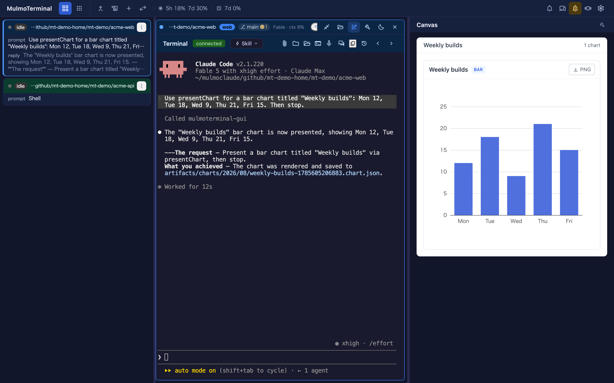
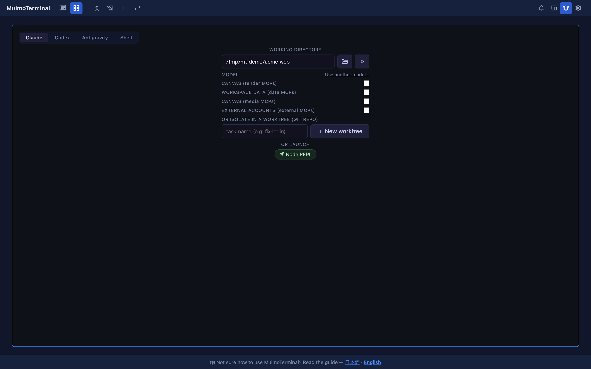
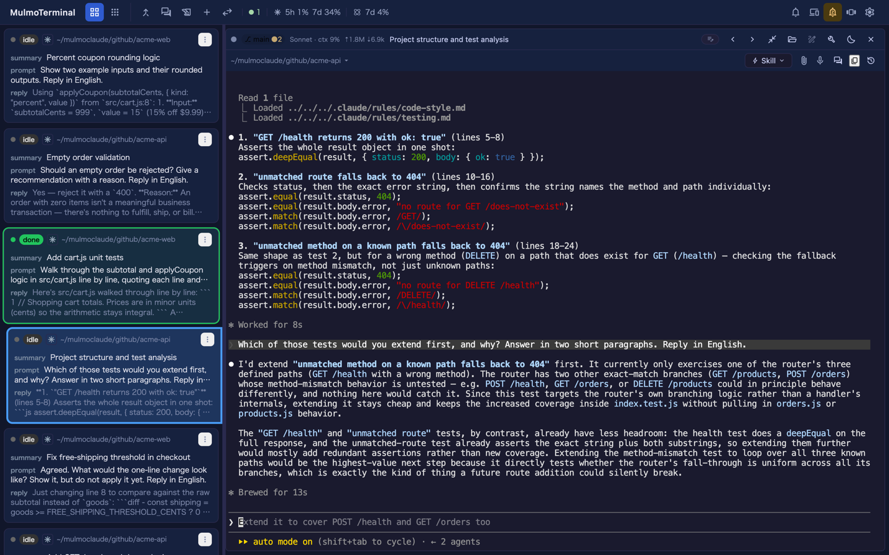

# Basics — what you can do in the grid today
{: .no_toc }

- TOC
{:toc}

---

## The grid is "a board of agents"

The grid view is the screen for **supervising many AI coding agents (Claude Code, Codex) in
parallel**. Vibe coding with one agent needs one terminal; going **parallel** is what makes this
screen necessary. Each cell is one independent
agent (or terminal). While one is thinking, you push another cell forward and pick up **only the ones that
call you** — **amber** for a cell awaiting input or a permission, a **green ring** for a turn that finished and
awaits review — the goal is to run many agents solo instead of babysitting them all.

**The grid is the app.** `http://localhost:34567/` lands here (the URL settles on `/terminals`), and
there is no second screen to switch to: focusing on one agent is **zooming its cell**, which gives
it the window and opens the **GUI panel (Canvas)** beside it — where that agent's tool calls render
as diagrams, forms, images, documents and slides rather than printed text.



{: .note }
> **Changed in 4.0.0.** Until 3.x there was a separate *single view* at `/chat` with its own
> toolbar. It is gone; everything it had is in the grid, and `/chat` now lands on the grid like any
> other unknown URL. → [4.0.0 setup guide](v4.0.0.html)

The top toolbar is one row, split by a rule into **which view you are in** and **what you do inside
it**:

| Group | Buttons |
|---|---|
| **Switch view** (left of the rule) | **Grid** and **Collections** — the two places to be |
| Inside Collections | **Feeds**, **Wiki**, **Accounting**, **Files** appear once you are in the content section |
| Inside the grid | **Pull requests**, **Worklog**, **New terminal**, cell ordering, the status tally |
| Always | sound, roster / filmstrip, **Settings** |

A full-screen surface (Collections, Wiki, PRs, Accounting, Files) **returns to the view you opened
it from** when you close it.

## Launching an agent or a shell (launcher form)

Empty cells in the grid show a **launcher form**. This is where you choose **what** to run and **where**.



| Part | Role |
|---|---|
| **Claude / Codex / Antigravity / Shell** toggle | Choose what runs in this cell — an **agent**, or **Shell**: your OS default shell (`$SHELL`), with nothing to install and nothing to configure |
| **WORKING DIRECTORY** | Enter the working directory (the play button launches it). Frequently used directories are offered as clickable *cwd preset* **chips** that fill the field (the chip's play button launches right away) |
| **Model picker** (when Claude is selected) | Pick the backend / model for this session only (→ [providers](providers.html)) |
| **Canvas / Workspace data / External accounts** toggles (with an agent selected) | Register a GUI tool group (`render` / `data` / `media` / `external`) as an MCP server **for the directory, not for this session** (→ [which directory to launch in](#launch-dir)) |
| **OR ISOLATE IN A WORKTREE** | In a git repo, enter a task name and hit **New worktree** to create an isolated worktree and launch there. Existing worktrees are listed below it |
| **OR RESUME HERE** | Sessions that already exist in this directory — click one to continue it |
| **OR LAUNCH** | Start a configured **launch command** (`codex`, `htop`, anything) as a persistent terminal |

**A worktree holds one session.** It is tied to a branch, so it is never started twice: a listed
worktree row says `resume` and continues the session it already has, or nothing and starts its
first one. A row marked `in use` has its session open in another terminal and cannot be clicked —
close it there first. The refusal follows the directory rather than the row, so the same worktree
pasted into **WORKING DIRECTORY** or picked from a recent-dir chip will not launch either — the
server refuses it whichever client asks, so a path spelled another way does not slip past.

The limit is on **agents**: Claude, Codex or Antigravity, including an **OR LAUNCH** command that
runs one of them. A **Shell**, and a launcher that runs anything else (`yarn dev`, `lazygit`),
stays free — a worktree an agent is working in is exactly where you want those.

**OR RESUME HERE** works the same way: a session marked `● open` is being viewed somewhere and is
refused, because opening it here would detach whoever has it. "Somewhere" includes another browser
tab and a second `mulmoterminal` running on this machine.

**Change the directory and these lists empty at once.** Everything under **WORKING DIRECTORY** —
**OR RESUME HERE**, the worktree rows, **OR RUN A SCRIPT** — was read for the directory that was in
the field at the time, so the moment you type or pick a different one they are replaced by a single
`Loading this directory's sessions, worktrees and scripts…` row until the new ones arrive. Rows left
standing through that wait would be the previous directory's under the new directory's name, and
clicking one resumes exactly the session it offers.

**Shell** takes the same working directory and the same play button as an agent. A shell has no
model, no MCP registration and no worktree, so those rows disappear while it is picked — and the
cell it opens is a persistent terminal (running / exited), not an agent session.


### Which directory to launch in — the workspace or a project {#launch-dir}

**What you put in WORKING DIRECTORY decides which GUI tools that cell gets.**
The reference point is the **workspace** — the server's default working directory (`CLAUDE_CWD`).
It is settled in this order: `--cwd`, then the `CLAUDE_CWD` environment variable, then the directory you ran `npx mulmoterminal` in.
When you lose track of which one it is, the `Workspace: …` line printed at startup is the answer.
Collections, Wiki and Accounting read and write there whichever cell you are in (only the Files pane beside an enlarged cell follows that cell's directory).

| The cell's working directory | Claude | Codex / Antigravity |
|---|---|---|
| **The workspace itself** | Carries the **whole** GUI MCP. Your [MCP servers](config.html#settings-modal) (`userMcpServers`) are merged into it too — and in exchange **that directory's own MCP config is not read** | No such rule. It gets **only the tool groups registered for that directory** |
| **A project directory** | **No whole GUI MCP.** The directory's own MCP config (`.mcp.json`, `claude mcp add -s local`) loads normally, so register a tool group with the MCP toggles when you want GUI tools | Same |

**To keep doing what you did in the single view in 3.x, launch Claude in the workspace.**
That is the directory the single view ran in, so a Claude cell started there carries the same thing — drawing into the Canvas, working with collections, with no toggle to turn on.

{: .note }
> **If you also run MulmoClaude, make the workspace the directory MulmoClaude uses** (`~/mulmoclaude` by default).
> **It is not the directory you cloned MulmoClaude into** — it is the shared place both apps keep their data.
> To make it the default, run `npx mulmoterminal` from there or pass `--cwd ~/mulmoclaude` — it is settled when the server starts, so changing it means restarting it.
> The preset skills and help docs are seeded only when the default working directory is that workspace.
> → [Environment variables](config.html#env) (`CLAUDE_CWD` / `MULMOCLAUDE_WORKSPACE_PATH`)

**Codex and Antigravity have no such rule.**
Even in the workspace, their GUI tools are whatever that directory has registered.
When you want one of them drawing into the Canvas or touching collections, turn on the MCP toggles you need: **Canvas** (`render` / `media`) is the panel beside an enlarged cell, **Workspace data** (`data`) is collections and the books, and **External accounts** (`external`) is Google, X and the like.
A toggle registers **the directory, not the session**, so it takes effect on the next session started there — it never reaches a session already running.
Antigravity reads them from `.agents/mcp_config.json` (→ [2.8.0 setup guide](v2.8.0.html)).

## Reading a cell — "what each agent is doing and where"

The header of a running cell has two rows. Together they capture that agent's **status, location, and current work**.


- **Row 1 (what to compare):** status dot, project badge, git chip (`⎇ branch ●changes`), **model /
  context size**, what that agent is **doing right now**, a note you can write, and reorder /
  expand / set aside / close.
- **Row 2 (what to read and do):** the **directory path** — click it for a menu with *Reveal in the
  file manager*, *Browse files in the app*, *New terminal here*, and the repo's *Repository /
  Issues / Pull requests* — then **Run**, **Skills**, **Insert a file path** (the default buttons —
  [replaceable in config](config.html#header)), and **Activity timeline** (tool-call history). The
  connection state appears here only while it is connecting or has failed.

> **Status shows up as color.** A bluish border means **working** (thinking), **amber means awaiting input or a
> permission** (Needs input), a **green ring + glow means a finished, unreviewed turn** (Done — review; the
> thumbnails and roster rows use that same green), and neutral means idle. A sound plays too, so you know you've been **called without watching
> the screen**. This is the heart of the grid.

## Tiling many, pages, and reordering

- Add cells with **New terminal** in the toolbar. Up to **9 cells** per page; overflow moves to the next page (tab).
- The ordering button cycles three modes — **auto** (attention-first: cells needing you float up), **manual** (arrange them yourself with each cell's move buttons), and **priority** (the order each project declares as `orderPriority` in its `.mulmoterminal.json`, see [Configuration](config.html#order-priority)).


## Zooming into one (the cockpit roster)

Hit a cell's **Expand** (expand) to show that agent large — and next to it, the **cockpit roster**: a text list
with one row per session (the default). Each row carries the directory, an **AI summary**, the last prompt,
the latest reply, a status word (running / planning / done / idle …), and the branch's **PR phase** badge
(draft / CI fail / changes / ready / merged …). **Click a row to swap** which terminal is enlarged; the ⋮ menu
reorders rows. You stay zoomed in while still reading, in plain text, what everyone else is doing and how far
along it is — this is the main screen for running many agents.



The **Show list roster / Show thumbnail strip** button in the top-right corner switches between the roster and the **filmstrip** (a thumbnail
strip; click a thumbnail's header margin to switch cells). **Restore** returns to the grid.


### Switching the enlarged terminal from the keyboard {#keyboard-zoom-switch}

You can bind keys that move the enlargement to the next / previous terminal — the keyboard equivalent of
clicking a roster row, so you can walk the whole board without reaching for the mouse. The order followed is
the one on screen, so it respects the roster's current sort (including attention-first ordering).

{: .important }
> **Nothing is bound out of the box.** Any key this claims is a key the program inside the terminal stops
> receiving, so that trade is yours to make: add a `keymap` to `~/.mulmoterminal/config.json` and the
> shortcuts turn on. With no `keymap`, they stay off entirely.

```json
{
  "keymap": {
    "zoom-next": "PageDown",
    "zoom-prev": "PageUp"
  }
}
```

→ **Binding syntax, the full action list, and which combinations can never be bound:
[Configuration → Keyboard shortcuts](config.html#keymap).**

Two behaviours worth knowing:

- **They only work while zoomed.** In the normal grid nothing happens, because an un-zoomed grid has no
  "current terminal" — the enlarged cell *is* the selection.
- **They stop at both ends** rather than wrapping. With only two terminals this means roughly half of your
  presses do nothing: previous-on-the-first and next-on-the-last are deliberately no-ops.

Collapsing with **Restore** returns you to the page holding the terminal you were just looking at, not the page you
originally zoomed in from.

{: .warning }
> **A bound key is taken away from the program inside the terminal.** Bind `PageDown` and, while zoomed, it
> no longer reaches `less`, `vim`, or Claude Code's own paging. Modifiers are matched exactly, so binding the
> bare key leaves **`Shift`+`Page Up` / `Shift`+`Page Down`** alone — they still scroll the terminal's
> scrollback, which is the usual way out. An active IME conversion always passes through, so a candidate list
> paging with Page Down keeps working.

On a Mac laptop keyboard there are no dedicated Page Up / Page Down keys; use **`Fn`+`↑`** and **`Fn`+`↓`**.

## Mixing Claude, Codex and Antigravity {#claude-and-codex}

In the same grid, you can launch **Claude**, **Codex** or **Antigravity** (`agy`) per cell — or **Shell**, when
you only want a terminal. The agents share the same terminal experience, persistence, GUI panel, and visibility
machinery. Use each for its strengths, or throw the same task at several and compare.

Antigravity needs `agy` on your `PATH`. `ANTIGRAVITY_BIN` / `ANTIGRAVITY_MODEL` / `ANTIGRAVITY_HOME` override the
binary, the model, and where it keeps conversations. One difference worth knowing: its GUI-panel registration is
written **per directory** (`.agents/mcp_config.json`, kept out of your `git status`), not per session, because
that is the only project-scoped file `agy` reads.

---

Next: [Scenarios — usage by scenario](scenarios.html)
