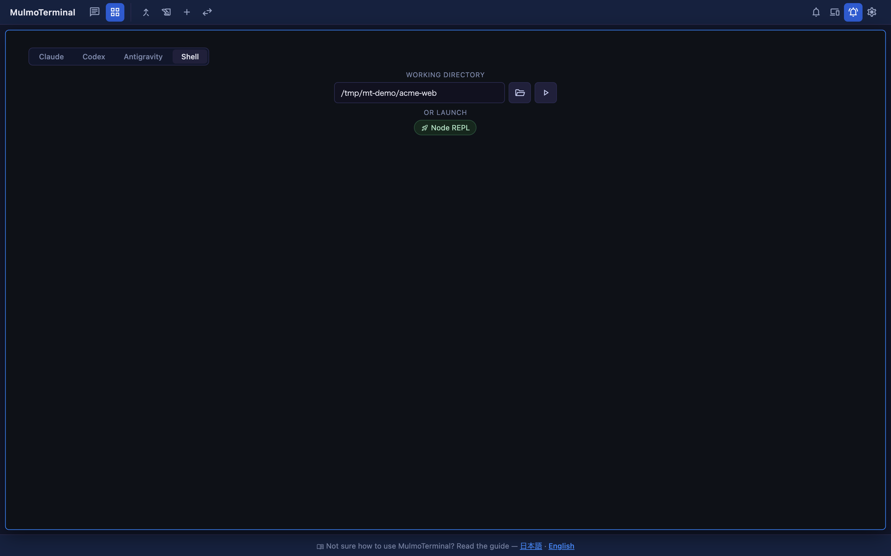
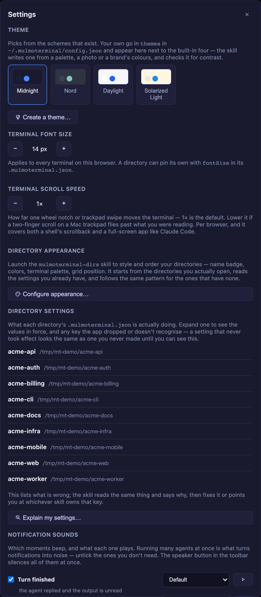
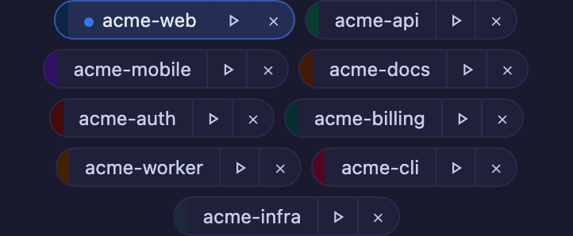

# What changed in 2.8.0
{: .no_toc }

Written on **2026-07-30**, as a snapshot of that day. Behaviour moves; this page does not. For the
reference that is kept current, follow the links out of each section.

- TOC
{:toc}

---

## If you only read one thing

**Upgrade. Everything new here is on by default. Two things are worth five minutes of setup: ranking
your directories, and — if you use it — installing Antigravity.**

```bash
npx mulmoterminal@latest
```

| What you get | Where |
|---|---|
| A plain shell in an empty cell — nothing to install, nothing to configure | Grid, empty cell |
| **Antigravity** (`agy`) as a third agent, GUI panel included | Everywhere you pick an agent |
| Paste a screenshot and get its path — in Chrome too | Any terminal |
| A button in Settings that starts the skill which writes that setting | Settings |
| Launcher chips that stay in one order, so you can aim at one | Launcher |
| Tool Call History that fills up for Codex and Antigravity | Tools pane |

| What was broken, and is fixed | Where |
|---|---|
| A terminal blank down its right side and along the bottom, that a reload did not fix | Any terminal |
| A running launcher chip was invisible once directories had colours | Launcher |
| `/api/remote-host/status` and `/api/google/status` returned 403 from the LAN | Remote access |
| Your session note was missing from the cockpit roster, and from the phone's session screen | Roster, phone |

---

## Open a plain shell in an empty cell

An empty cell's launch row now has four choices: **Claude / Codex / Antigravity / Shell**.



### How to use it

1. In an empty cell, press **Shell** in the top row.
2. Type a **working directory** (your presets autocomplete).
3. Press the **▶** button.

You get your OS default shell (`$SHELL`, or `/bin/sh` if that is unset) in that directory. **There is
nothing to configure** — no launcher entry, no install, no model.

The model picker, the MCP toggles and **OR ISOLATE IN A WORKTREE** disappear while Shell is selected,
because a shell has none of them. **OR LAUNCH** and **OR RESUME HERE** stay, since they are separate
actions.

A shell could always be opened by keyboard shortcut, from a running cell's header
(**New terminal here**), and from the phone. The one screen it could not be opened from was the empty
cell — which is the first screen you see on a fresh install.

> Reference: [Basics](basics.html)

---

## Run Antigravity next to Claude and Codex

**Antigravity (`agy`) is now a first-class agent**, with everything Claude and Codex have: resume
across a reload, the GUI panel, and a place in every picker — the launch row above, the single view,
the sidebar and tab bar, and the Collections browser.

### How to use it

1. Install Antigravity's own CLI so that `agy` is on your `PATH`.
2. Pick **Antigravity** wherever you pick an agent, and launch as usual.

Nothing else. If your binary has another name or you want a fixed model:

| Variable | Default | What it does |
|---|---|---|
| `ANTIGRAVITY_BIN` | `agy` | The binary to spawn |
| `ANTIGRAVITY_MODEL` | agy's own default | Passed as `--model` |
| `ANTIGRAVITY_HOME` | `~/.gemini/antigravity-cli` | Where agy keeps its conversation storage |

### The GUI panel, and the one thing that is different

The Canvas switches work as they do for Claude — flip **render**, **data**, or whichever group you
want, and agy can draw into the panel.

**But the registration is per directory, not per session.** `agy` takes no MCP flag: it reads its
servers from a file, and the only project-scoped file it reads is `.agents/mcp_config.json`, which
every session in that directory shares. So:

- MulmoTerminal writes that file from **the directory's** switches, and rewrites it whenever you flip
  one or start an agy session.
- Servers in it that MulmoTerminal did not write are left alone, and the file is removed once no group
  is on.
- It is kept out of your `git status` through `.git/info/exclude` — **not** your `.gitignore`, which
  stays yours.

**How to tell it worked:** run `/mcp` inside the agy session. It lists `mulmoterminal-render` with
`presentDocument`, `presentForm`, `presentChart`, `presentHtml`.

> Reference: [Basics](basics.html#claude-and-codex) ·
> [Agents in the README](https://github.com/receptron/mulmoterminal#agents-claude-codex--antigravity)

---

## Paste a screenshot into the terminal

Copy an image, click into a terminal, paste. The file is saved and **its absolute path is typed in at
your cursor** — not sent, so you finish the sentence yourself.

### How to use it

1. Copy an image to the clipboard. On a Mac, `Shift`+`Ctrl`+`Cmd`+`4` puts a screen grab straight
   there without writing a file.
2. Click the terminal and paste (`Cmd`/`Ctrl`+`V`).
3. The path appears at the cursor, with a trailing space. Type your question around it and press
   Enter.

**This works in every browser, including Chrome, and when you are connected from another machine** —
the clipboard carries the bytes, so no browser has to disclose a path.

- The image goes to the same place a dropped file goes, and the session is granted access to it in
  the same way. Same 110 MiB cap, same cleanup.
- **Pasting text is unchanged.** Copying from a web page — which puts HTML *and* an image on the
  clipboard — still pastes as text.
- Paths inserted by paste, drag-and-drop and the file button now end with a **space**. Two pastes in a
  row used to produce `path1path2`.

> Reference: [Basics](basics.html)

---

## Settings starts the skill that writes the setting

Settings shows the settings it has controls for. Everything else — a colour scheme of your own, a
keymap, a per-directory sound — is written in a file, and was therefore invisible: not "configurable
elsewhere" but **something the app cannot do**.

Five sections now carry a button that starts the skill which writes that part of the config, in a real
session, in the screen you pressed from.



| Section | Button | What the skill does that the controls above it cannot |
|---|---|---|
| Theme | **Create a theme…** | The picker chooses among the themes that exist. The skill **writes a new one**, from a colour, a mood, or an image you point at |
| Directory appearance | **Configure appearance…** | Colours, name badge, font size and grid rank for a directory — reading what your other directories already do, so a new one fits in |
| Directory settings | **Explain my settings…** | That panel shows which keys were **dropped in validation**. The skill says why, and fixes them |
| Notification sounds | **Configure notifications…** | Per-kind and per-directory sounds, and which kinds reach your phone — none of which has a control |
| Keyboard shortcuts | **Set up shortcuts…** | That panel is read-only. The skill writes `keymap` |

Pressing one from the grid gives you a **cell in the grid** — it no longer throws you into the single
view. (Pressing one in the single view keeps you there. The rule is: you get a session where you
were.)

> Reference: [Settings modal](config.html#settings-modal) ·
> [Make your own colour scheme](config.html#custom-themes) ·
> [Keyboard shortcuts](config.html#keymap)

---

## Launcher chips: one fixed order, and you can see which is running

Two separate things were wrong with the launcher's directory chips: they **moved** — the row was in
"most recently launched" order, so nothing could be found by position — and once several directories
had colours, **the running one was no longer distinguishable**, because a directory's colour and
"running" were drawn in the same channel at the same strength. A blue-ish directory looked busy while
idle.



### Reading a chip

- **The hue on the leading stripe** says *which directory*.
- **A background, a warmer border and a slow pulse** say *a session is running here*. An idle chip has
  no background, whatever colour it is. (`prefers-reduced-motion` drops the pulse; the rest still
  says it.)

### Putting them in the order you want

The chips follow each directory's `orderPriority`, ascending — the same rank the grid's **priority**
sort mode uses, so **the side menu and the chip row finally agree**.

In each project's `.mulmoterminal.json`:

```json
{
  "name": "web",
  "orderPriority": 10
}
```

Give the next one `20`, the one after `30` — leave gaps so you can insert without renumbering. A
directory that declares none keeps today's behaviour: it sits after all the ranked ones, in the order
you last launched them.

Or press **Configure appearance…** in Settings and let `mulmoterminal-dirs` rank them with you.

> Reference: [Where this project sits in the grid](config.html#order-priority)

---

## Tool Call History fills up for Codex and Antigravity

In the tools pane, **Available Tools** listed what a Codex or Antigravity session could call, and the
**Tool Call History** below it stayed empty forever — because that history had one source, the hook
mechanism only `claude` has. Half a pane working reads as broken, not as missing.

Both now record. Open the tools pane in a codex or agy cell and its GUI tool calls appear as they
happen, including a **refused** one — a tool outside the group you switched on — which is usually
exactly what you opened the pane to find.

**Read the note at the top of the list.** For Codex and Antigravity this is a **GUI-only** history:
their `Bash`, their file edits and their other MCP servers never pass through MulmoTerminal, so an
empty list means "no GUI tool calls", not "did nothing". For Claude it is still the full history.

> Reference: [Features](features.html)

---

## A terminal blank on its right and bottom, that a reload did not fix

The report was a screenshot: text wrapping at about 77 columns inside a terminal about 136 columns
wide, the whole right side and the bottom rows empty, keystrokes arriving but the layout unreadable —
**and a reload did not clear it.**

Measured from that screenshot, this was not a redraw that got skipped. **tmux's window really was that
size.** Which is why nothing recovered it: reattaching sends the terminal's size, the kernel raises
`SIGWINCH` only when the size actually *changes*, and every recovery path there was could do no more
than re-send the size the PTY already had. Once the window drifted out of step, there was no way back.

Now, after a resize settles, the server asks tmux what size its window is and compares it with your
terminal's. If they disagree it shrinks the pane by one row and puts it back — a real change, so a
real `SIGWINCH`, so a real repaint. Of three candidate repairs measured against a live desync, this is
the only one that worked.

**How to tell you have the fix:** zoom a cell, then open the file pane or drag its divider so the
terminal's width changes. The text stays inside the terminal it is drawn in. If you ever see the blank
right side again, the server log now says `repairing` when it corrects one — that line in an issue
report is worth a lot.

This is a **countermeasure, not a cure**: the mechanism that makes tmux drift is still not pinned
down, so [#957](https://github.com/receptron/mulmoterminal/issues/957) stays open. The repair works
regardless of the cause.

**Related, and shipped with it:** coming back to a cell from a background tab could leave the screen
scrambled — text from two different moments interleaved, the bottom half empty. What a reattaching
browser replays is a **diff stream**, not a screen, so anything drawn before that window opened was
never sent. After a reattach the server now asks tmux to repaint the whole pane.

---

## Everything else

- **Reachable from the LAN again:** with `MULMOTERMINAL_HOST=0.0.0.0` and
  `MULMOTERMINAL_ALLOWED_ORIGINS` set, `GET /api/remote-host/status` and `/api/google/status` returned
  403 forever, so the remote-host and Google panels never loaded from another machine. Browsers do not
  send `Origin` on a same-origin GET, and those two routes were the only guarded GETs.
- **Your session note now shows everywhere it should:** in the cockpit roster of a zoomed grid, and in
  the header of an opened session **on your phone** (that half needs mulmoserver's next release; this
  side is ready and harmless until then).
- **The config skills are seven, not one:** `mulmoterminal-config` is now a router that also **audits**
  your real config, with `-dirs`, `-theme`, `-header`, `-keys`, `-model` and `-notify` doing the
  writing. Asking to change a colour no longer loads everything about every setting, and three areas
  that were in use but undocumented — custom `themes`, global header `buttons` / `chips`, and
  `soundKinds` / `sounds` — are covered now.
- **Update announcements:** new releases are posted **in Japanese** on X by
  [Singularity Society](https://x.com/SingularitySoci).
- **Docs:** four environment variables that existed and were documented nowhere are now in
  [Configuration](config.html), and the Windows daily CI build is green again (a test bug, not a
  product one).

For the full list, see the [changelog](https://github.com/receptron/mulmoterminal/blob/main/docs/ChangeLog.md).

---

## Links

- [Guide index](index.html) — the living reference
- [Basics](basics.html) · [Configuration](config.html) · [Features](features.html)
- [Changelog](https://github.com/receptron/mulmoterminal/blob/main/docs/ChangeLog.md)
- [Issues](https://github.com/receptron/mulmoterminal/issues) — `/mulmoterminal-bug-report` in any
  session will check your config and version first, then help you file one
