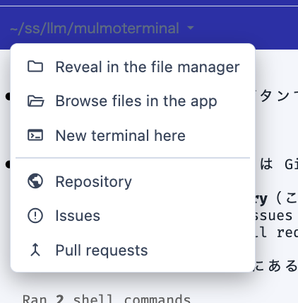

# 4.4.0 — Every cell keeps its own pane, and the Canvas opens a file on its own

**A snapshot of 4.4.0 as released on 2026-08-04.** It will go out of date as the app moves on; that
is fine and expected. For the reference that is kept current, follow the links to the living guide
in each section.

```bash
npx mulmoterminal@latest
```

**Most of this release needs no configuration** — the panes, the Canvas button, the connectors and
the speed are all yours on upgrade. Two sections below do have something to turn on or to check:
the [work comment](#work-comment) is opt-in, and the [header icons](#header-icons) moved, so read
that one if you had built a habit around them.

---

## Each cell remembers its own right pane

Before: the right pane was **one setting for the whole grid**. Open the Canvas on one terminal and it
opened on the next one you enlarged; close it there and it was closed when you came back to the
first.

Now every cell answers for itself.

**Nothing to do.** Upgrade and walk the zoom — each terminal shows the pane *it* had open: files,
canvas, tools, or nothing at all.

- **A cell that never asked for a pane arrives with none.** Closing is an answer too, so a cell you
  closed the pane on stays closed.
- **You can press a pane button on a tiled cell**, before enlarging anything. The Canvas cannot
  actually open with nothing enlarged, so the press is remembered and enlarging that cell opens it.
- **A reload restores by session**, not by position — capped at the 40 most recent, oldest dropped
  first.
- **The pane width, and the full-width takeover, stay shared** across cells. Only *which pane* is
  per-cell.

**How to tell you have it.** Enlarge one cell and open the Canvas; collapse, enlarge a different
cell. Before 4.4.0 the Canvas was already open there. Now it is not.

Reference: [basics](basics.html) in the living guide.

---

## Open a file in the Canvas without asking an agent

The Canvas draws what an agent's tools produced, so looking at a document that was already on disk
meant asking an agent to present it to you.

The **Files pane toolbar now has a Canvas button.**

1. Enlarge a cell and open the **Files** pane.
2. Select a file it can show — a `.md` document, an `.html` page, or a MulmoScript story.
3. Press **Canvas**.

The button **only appears when the selected file is one it can open**, so you do not have to guess.
What opens is a real Canvas card: it is stored, it comes back after a reload, and it folds together
with the agent's own card if an agent later presents the same file.

**MulmoScript stories have one extra rule.** A story must live in the **workspace's**
`artifacts/stories/` directory. A project directory may have an `artifacts/stories/` of its own, and
those are not the stories this opens — the tool that renders them addresses stories relative to the
workspace and has no way to name one outside it. Documents and HTML pages have no such restriction
and can be anywhere you can browse to.

**How to tell you have it.** Open the Files pane on any cell and click a `.md` file. The Canvas
button appears in the toolbar; press it and the document renders, with PDF export and Edit Markdown
Source working as they do for an agent-drawn card.

Reference: [basics](basics.html) and [features](features.html) in the living guide.

---

## The cell header's path is now a menu — and six icons went into it
{: #header-icons }

This is the one change that may break a habit, so it is worth thirty seconds.

The path moved from row 1 to **row 2** and became a dropdown (it has a `▾` on it). Clicking it gives
you:



**The GitHub menu is the one to point out, because it did not go away — it moved here.** The GitHub
icon used to open a menu of its own with exactly these three items, and they are unchanged below the
separator: **Repository**, **Issues**, **Pull requests**. Same destinations, same rule for when they
appear (only when the directory's remote resolves to GitHub). If you went looking for that icon and
concluded the feature was gone, this is where it went.

The other three items were permanent icons until now: **Reveal in the file manager** (kept first,
since it is exactly what clicking the path used to do), **Browse files in the app**, and **New
terminal here**.

So four buttons left the default header set — `reveal`, `files`, `terminal`, `gh` — along with the
GitHub icon. Every one of them was "do something to this directory", which is what the path itself
now says. `reveal` in particular was byte-for-byte the same action as clicking the path.

**If you configure `buttons` yourself, nothing changed for you** — you were never using the default
set. **Nothing changed about them as config either:** define any of them and it works exactly as
before. You will then have it in both places, since the path menu is fixed.

Remember that setting `buttons` **replaces the whole default set** rather than merging into it, so
list `pick-file` and `pr` too if you want to keep them:

```json
{
  "buttons": [
    { "id": "reveal",   "icon": "folder",      "label": "Reveal folder",       "run": "open", "open": { "reveal": "${dir}" } },
    { "id": "files",    "icon": "folder_open", "label": "Browse files",        "run": "open", "open": { "files": "${dir}" } },
    { "id": "terminal", "icon": "terminal",    "label": "New terminal here",   "run": "open", "open": { "terminal": "${dir}" } },
    { "id": "gh",       "icon": "public",      "label": "Open on GitHub",      "run": "open", "open": { "url": "https://github.com/${repo}" }, "when": "repo != " },
    { "id": "pick-file","icon": "attach_file", "label": "Insert a file path",  "run": "open", "open": { "pickFile": true } },
    { "id": "pr",       "icon": "merge",       "label": "Open this branch's PR","run": "open", "when": "isGitRepo", "open": { "pr": true } }
  ]
}
```

Two buttons stayed on purpose: **`pick-file`**, because it types into the prompt rather than going
somewhere, and **`pr`**, because it hides itself when there is no PR and is worth one click when
there is.

Reference: [config](config.html#header) and [basics](basics.html) in the living guide.

---

## Your claude.ai connectors work in the workspace and the single view

If you have Gmail, Calendar, Drive, Slack or Notion authorised on your claude.ai account — or your
own MCP servers in `~/.claude.json`, or a directory's `.mcp.json` — they were **invisible** to the
workspace cell and the single view, which are the two kinds of session most likely to need them. A
cell in any other directory had them all.

**Nothing to configure.** Upgrade and they are there.

**How to tell you have it.** Start a session in the workspace cell and ask it to do something that
needs a connector — read your calendar, search your mail. Before 4.4.0 it had no such tool. Note
that `claude mcp list` was **not** a way to check this and still is not: it says "Connected" because
that is the CLI running its own health check, not a report of what a running session can see.

**The cost, so it does not surprise you:** workspace cells and the single view now **start slower**
if you have several MCP servers configured, because they now load them. Measured here: about 8.0 s
to first window with none, 9–15 s with one unauthenticated server. This is the same trade MulmoClaude
already makes on the same workspace.

Reference: [config](config.html) in the living guide.

---

## Tell an issue you are working on it — and hear about it when that fails
{: #work-comment }

**This one is opt-in and off by default.** Turn it on in `~/.mulmoterminal/config.json`:

```json
{ "issueWorkComments": true }
```

With it on, starting work from an issue posts **one** comment and then **edits that same comment**
as the work moves. It used to post a new comment for "started" and another for "merged", with
silence in between.

```
Merged in #1240. Work done in `1234-fix-login`.

- started — 2026-08-04 14:20 UTC
- PR #1240 — 2026-08-04 15:05 UTC
- merged in #1240 — 2026-08-04 16:40 UTC

posted by MulmoTerminal
```

Three milestones only — started, PR opened, merged. **CI results are deliberately not included**:
they are on the PR already, and they flap. Edits send **no notification**, on purpose.

**If it cannot write, it now tells you.** Previously a `gh` that was logged in without write access
did nothing at all, forever — indistinguishable from having left the setting off. Now the cell header
shows a dismissible `issue not updated — …` notice naming the cause: `gh` not installed, not
authenticated, or no permission. The work itself carries on exactly as before; the comment is
skipped and the next milestone tries again.

**How to tell you have it.** With the setting on, start work from an issue and then open a PR for it:
the original comment gains a `PR #…` line instead of a second comment appearing.

Reference: [github](github.html) and [config](config.html#issue-work-comments) in the living guide.

---

## A drawing on the tiled grid now shows itself

When an agent calls `presentDocument` or `presentChart`, that drawing **is** its answer. On the tiled
grid that answer used to leave no trace except a count on a chip, because the Canvas pane only exists
beside an enlarged cell.

Now the cell that drew enlarges itself and the Canvas opens beside it. **Nothing to do.**

- It does **not** happen while a full-screen overlay is up — you are reading something else, and
  coming back to a grid rearranged behind you would be worse.
- It does **not** interrupt a cell you are working in: a background cell drawing while another is
  enlarged still just gets the chip.

**A single-terminal grid can now be enlarged too**, which it previously refused. That refusal was
also what locked the Canvas, Tools and Files panes away entirely on a one-terminal grid — those panes
exist only in the enlarged row — so the chip did nothing when clicked and a drawing had nowhere to
go, with no error to explain it.

Reference: [basics](basics.html) in the living guide.

---

## Everything got faster, and there is a new directory on your disk

Five places re-read entire transcript files on **every request**. On a big project that is seconds of
a frozen event loop, which freezes every terminal in the app. They now resume an incremental fold
instead — and persist it, so a restart and a second copy of the app do not pay again.

| what | before | after |
|---|---:|---:|
| Session list, 2.1 GB project | 8,700 ms | **0–1 ms** |
| Session summary after one turn, 508 MB session | 2,154 ms | **3 ms** |
| `/api/cost`, 1.1 GB project | 2,449 ms | **1 ms** |
| Timeline overlay, 508 MB session | 2,247 ms | **0 ms** |
| Decision scan after one turn, 484 MB session | 2,164 ms | **1.3 ms** |

**Nothing to configure.** The one thing worth knowing:

> **New on disk:** `~/.mulmoterminal/transcript-index/` holds the saved folds — a few KB of JSON per
> transcript, and only for transcripts over 10 MB. Two large projects came to 24 files / 96 KB here.
> **It is safe to delete**; the app rebuilds what it needs. Nothing is written into
> `~/.claude/projects`, which is Claude Code's to manage.

**How to tell you have it.** Open a project whose session list used to take seconds. The first load
still does real work; the second one — and the first one after a restart — is effectively instant.

Reference: [features](features.html) in the living guide.

---

## Also fixed

- **Changing the directory in an empty cell's launcher** no longer leaves the previous directory's
  resume history, worktrees and script chips on screen and clickable. They were real sessions, so
  clicking one opened exactly that session — from the wrong directory. The lists now clear
  immediately and a loading line explains the gap.
- **A finished background task** no longer replaces the cell's task line with the harness's own
  `<task-notification>` XML, and no longer has the AI title generated from it.
- **A session started in the workspace** is badged `WORKSPACE` — the same role name its launcher chip
  uses — instead of that folder's configured name.
- **A corrupt index file** can no longer make a session disappear from the list permanently.
- **The Windows daily CI** is green again.

---

The full detail is in the [changelog](https://github.com/receptron/mulmoterminal/blob/main/docs/ChangeLog.md).
