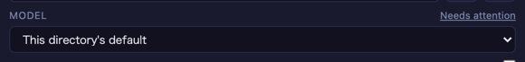
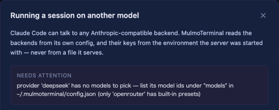

# 4.5.1 — A backend with no models says so

**A snapshot of 4.5.1 as released on 2026-08-05.** It will go out of date as the app moves on; that
is fine and expected. For the reference that is kept current, follow the links to the living guide
in each section.

```bash
npx mulmoterminal@latest
```

**Nothing to configure** — with one exception. If you registered a backend under an `id` other than
`openrouter`, it needs one line adding, and this release is what finally tells you so.

---

## The MODEL list stops offering what it cannot run

**What was broken.** A backend registered in `providers` appeared in the launch form's **MODEL**
dropdown and could not be selected — not by a click, not with the arrow keys ([#1432](https://github.com/receptron/mulmoterminal/issues/1432)).

It was never an option. A provider with **no models** rendered as a group *header* with nothing
under it, and a browser draws that as a shaded row that the mouse and the keyboard both skip.

**Why a backend ends up with no models.** The measured model list belongs to **OpenRouter alone** —
it is matched by the provider's `id`, so a provider registered as `deepseek`, `moonshot` or a
company gateway starts with **nothing**, and must list its own. A session cannot start on it either:
naming a provider without a model is refused at launch.

**What you see now.** The provider is left out of the list, and the link beside the MODEL label
changes to **Needs attention**:



Open it, and the reason is the first thing in the panel:



**What to do.** Add the model ids you want to run to that provider's entry:

```json
{
  "providers": [
    {
      "id": "deepseek",
      "label": "DeepSeek",
      "baseUrl": "https://api.deepseek.com/anthropic",
      "tokenEnv": "DEEPSEEK_API_KEY",
      "maxOutputTokens": 16000,
      "models": ["deepseek-chat", "deepseek-reasoner"]
    }
  ]
}
```

Restart the server. Each id appears under that backend's name, marked `not tested` — meaning nobody
measured it, which is more honest than implying somebody had.

**If you already wrote `models` and the picker still offers none**, every id in it was refused. A
model id may contain **letters, digits and `. _ : / - ~`** — so an object like `{"id": "…"}`, a value
with a space, or a `models` that is not an array is dropped. It used to be dropped in silence; the
server now names what it dropped, on the terminal it was started from:

```
[providers] 'deepseek': dropped 1 unusable model id(s) — {"id":"deepseek-chat"}. A model id is letters, digits and . _ : / - ~.
```

Settings → **Models and backends** says the same thing in a word: a reachable backend with nothing
to pick reads **not in the picker** rather than `ready`.

Reference: [providers](providers.html#add-models) in the living guide.

---

## Choose a folder… works without zenity

**What was broken.** On a Linux desktop or under WSL2 without `zenity` installed, the launch form's
**Choose a folder…** button did **nothing at all** — no dialog, no message
([#1447](https://github.com/receptron/mulmoterminal/issues/1447)). The server tried exactly one
program, and every caller in the UI threw the failure away.

**What happens now.**

| host | what opens the dialog |
|---|---|
| macOS | `osascript` (built in) |
| Windows | PowerShell (built in) |
| **WSL2** | the **Windows** dialog over interop — `powershell.exe`, with the path converted back by `wslpath`. **Nothing to install** |
| Linux desktop | `zenity` → `kdialog` → `qarma` → `yad`, whichever is there |

**And when there is none, it says so** instead of appearing broken — you type the path in the field
as before. `npx mulmoterminal@latest init` now reports, on Linux, which dialog this host has.

**What to install**, if you are on a plain Linux desktop with none of them:

```bash
sudo apt install zenity     # Debian / Ubuntu
sudo dnf install zenity     # Fedora
```

`kdialog`, `qarma` and `yad` work equally well — if your desktop already ships one, there is nothing
to do.

Reference: [getting started](getting-started.html#init) in the living guide.

---

## The launch form's controls have a width again

Nothing to configure. 4.5.0's form capped **every** row at 360px, so a wide cell drew a narrow
column — 25 directory chips wrapped into 20 rows inside 360px while the cell was 1535px wide. That
cap was removed, which fixed the chips and stretched everything else: at a 1535px cell a checkbox
sat most of a screen away from its label.

So the two are now separate. **Directory chips take the whole cell** — they tile, so width buys rows
back. **Every other control shares one 560px cap**, wide enough for a long path with a worktree task
name beside it, narrow enough that a checkbox stays next to its label.

Reference: [basics](basics.html) in the living guide.

---

## How to tell you have it

```bash
npx mulmoterminal@latest --version
```

`4.5.1`. If the MODEL dropdown still shows a backend you cannot click, you are on an older build —
`npx` caches, so `@latest` is what forces the fetch.
