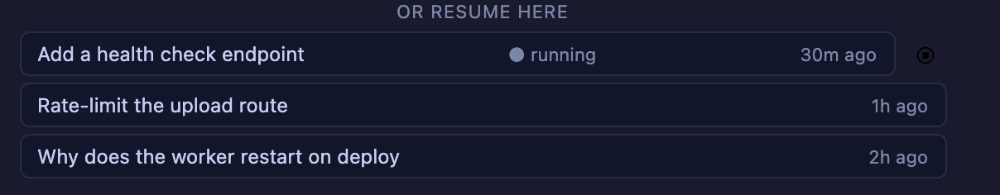

# 4.6.0 — The cells talk to each other

**A snapshot of 4.6.0 as released on 2026-08-06.** It will go out of date as the app moves on; that
is fine and expected. For the reference that is kept current, follow the links to the living guide
in each section.

```bash
npx mulmoterminal@latest
```

**Nothing to configure.** Everything here is on as soon as you are running 4.6.0 — the one thing
worth reading before you use it is what a round table costs, below.

---

## Round table — start a conversation between cells

Cross-terminal talk has existed since 2.x: press a button and one cell's last turn is carried to
another, one round trip, once. **Round table is that loop, run for you** — a ring of up to five
cells, each answering the previous one, for a turn budget you set.

### How to start one

1. Open **two or more cells** with agents in them. Any mix of Claude, Codex, Antigravity and Grok
   works; they never need to know about each other.
2. In the cell that should **speak first**, open the toolbar's **forum** button — the speech-bubble
   icon on the cell's second row, the same menu you already use to pull another terminal's last
   turn.
3. Under **ROUND TABLE**, tick the cells that should take a seat.
4. Choose **turns**, and press **Start**.


The note beside the dropdown counts **you in**: two ticked seats plus the cell you started from is
`3 seats, one turn each in order`. The button names the opener — `Start · #0 first`.

### What it costs, before you press it

**One turn is one real agent turn on a real account.** The budget is therefore a spending limit as
much as a runaway guard: a table of 3 with a budget of 20 is twenty full agent turns, and nothing
asks you again once it is running. The default is **6**, and 4 / 10 / 20 are the other choices.

Start small. A ring of three with 6 turns is enough to see whether the conversation goes anywhere.

### How it ends

| It stops when | |
|---|---|
| **The agents agree** | a reply contains the line `ROUND-TABLE-DONE` on its own. Every seat is told about the marker in the text it receives, so the agents can end it themselves |
| **The budget runs out** | the number you picked |
| **A seat does not answer in time** | the same timeout the one-off exchange already used |
| **You press stop** | the Start button becomes **running — stop** while a table is going |
| **The cell is closed** | closing the starting cell stops the ring |

The marker is matched as a **whole line**, so an agent that merely *discusses* `ROUND-TABLE-DONE`
does not end the conversation by mentioning it.

### What it does not do yet

- **The runner is in your browser.** Close the tab and the ring stops. It is not a server-side job.
- **Five seats maximum**, counting the cell you started from.
- **Only cells with agents.** There is no room to join, no MCP tool, no way for an agent to start a
  table or to discover another cell — a human ticks the seats, and that picker is the whole
  admission control.
- **Nothing is minuted.** The conversation lives in each agent's own transcript, as normal.

Reference: [features](features.html) in the living guide.

---

## The resume list belongs to the agent you picked

**Nothing to configure.** Until now the launch form's **OR RESUME HERE** rows were always read from
Claude's transcript directory — whatever the Agent Picker said. Pick Codex and the list still
offered *Claude's* conversations, and clicking one connected the codex endpoint to a Claude
transcript. Meanwhile a codex, Antigravity or Grok conversation you had started in a plain terminal
was reachable from no screen at all.

Now the list follows the picker:

| Agent Picker | the list under it |
|---|---|
| **Claude** | `~/.claude/projects` — the heading stays `or resume here` |
| **Codex** | your codex rollouts — the heading reads `or resume a codex conversation here` |
| **Antigravity** | agy's own conversations, headed `agy` |
| **Grok** | `~/.grok/sessions` for this directory, headed `grok` |
| **Shell** | no list — a shell has no conversation to resume |

Switching the picker replaces the list. Resuming a row carries the agent with it, so the cell
connects the endpoint that actually wrote the conversation. A **custom agent** runs Claude Code, so
it gets Claude's list.

Reference: [basics](basics.html) in the living guide.

---

## A session nobody is attached to now says so — and can be stopped there

**Nothing to configure.** A row in that same list can now read **● running**:



**What it means.** The conversation's session is still alive — the agent process is running — but
**no terminal is holding it**. That is what a server restart leaves behind: the browser lost the
session, the agent did not exit, and until now nothing on any screen could see it. They accumulate.
On one machine with 21 surviving sessions, **five** were live agents idle for 10–11 hours with
nobody attached.

**What you can do.**

- **Click the row** to resume it, as before — you get back the session that was already running.
- **Click the stop button** beside it to end it. It asks first:

  > Stop the session running "Add a health check endpoint"? Its conversation is kept — you can
  > resume it later — but anything it is doing right now is lost.

  The **conversation survives**: the transcript stays on disk and the row can be resumed afterwards.
  What is lost is the turn that was in flight.

**Only unattached rows get the button.** A row marked `● open` belongs to a terminal that is holding
it right now — possibly a tab you cannot see from here — so it is not offered.

**This is the manual half.** The list is per directory and per agent, so it does not reach a project
you have stopped opening. Automatic cleanup is still open as
[#1467](https://github.com/receptron/mulmoterminal/issues/1467).

Reference: [basics](basics.html) in the living guide.

---

## Every agent's cell shows its model and context

**Nothing to configure.** The two badges on a cell header's first line — the model with its context
percentage, and `⇡ ⇣` for what the conversation has spent — used to appear on Claude cells only.
They now answer for whichever agent the cell is running, and each one reports only what its own logs
actually record:

| Cell | Model + context | Tokens |
|---|---|---|
| **Claude** | `Opus · ctx 35%` | `⇡427k ⇣1.8k` |
| **Codex** | `gpt-5.5 · ctx 33%` — the window comes from codex's own log, not a table in this app | yes |
| **Grok** | `Grok · ctx 33%` — grok's real window (500,000 for grok-4.5) | yes |
| **Antigravity** | `Gemini 3.6 Flash · ctx 78%` — the model agy recorded for **that** conversation | yes |

Two things worth knowing:

- **A missing reading is not a zero.** If the tokens cannot be read, the cell shows the model name
  alone rather than `ctx 0%`. If the model cannot be read either, the badge hides. Nothing is
  guessed — a wrong percentage is worse than no percentage, and this is the number you use to decide
  whether to compact.
- **Grok and Antigravity refresh once a minute**, not at the end of each turn. Neither reports turn
  boundaries to us, so a cell polls instead; without it, the first reading a cell took would be the
  only one it ever showed. Claude and Codex update at turn end as before.

Reference: [basics](basics.html) in the living guide.

---

## How to tell you have it

```bash
npx mulmoterminal@latest --version
```

`4.6.0`. Then open a cell's **forum** menu with a second cell running: if there is no **ROUND TABLE**
section under the list of terminals, you are on an older build — `npx` caches, so `@latest` is what
forces the fetch.
