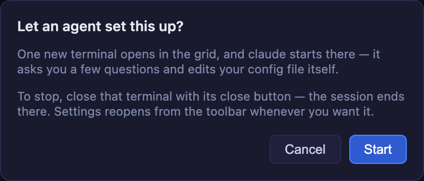

# 4.7.5 — Settings you can find, in a language you read

**A snapshot of 4.7.5 as released on 2026-08-09.** It will go out of date as the app moves on; that
is fine and expected. For the reference that is kept current, follow the links to the living guide
in each section.

```bash
npx mulmoterminal@latest
```

**Nothing to configure to get the new layout** — open Settings and it is there. The one thing worth
a minute is the new **Language** setting, and it has already picked for you if your browser asks for
Japanese.

---

## Settings is a sidebar now

Open Settings from the gear in the toolbar. Instead of one long scroll, there is a **sidebar of nine
groups** on the left and **one section at a time** on the right.


Where things live now:

| Group | Sections |
| --- | --- |
| **Appearance** | Language, Theme, Terminal font, Terminal font size, Terminal scroll speed, Waiting rows |
| **Projects** | Directory appearance, Directory settings |
| **Header & launch** | Launch commands, Header buttons and chips |
| **Input** | Terminal keys, Keyboard shortcuts, Voice input |
| **Models & servers** | Models and backends, MCP servers |
| **Notifications** | Notification sounds, Web Push notifications, Phone quick commands |
| **Integrations** | GitHub and GitLab, Pull request repos, Google account |
| **Sessions** | Sessions and background tasks, Sessions that survived a restart, Cost (estimated) |
| **Help** | Help & user guide |

**Voice input** only appears on a machine that can transcribe, so most setups see twenty-four of the
twenty-five entries.

Three things worth knowing:

- **From the keyboard, the whole sidebar is one Tab stop.** Tab into it, then use the **arrow keys**
  to move between sections — they wrap at both ends. Twenty-four separate Tab stops would have been
  more keystrokes than the scroll this replaces.
- **On a phone**, the sidebar becomes a **picker above the section** rather than eating the width.
- **A value you typed but have not applied survives** a trip to another section and back. The
  terminal font field is the one that matters here — type a stack, go look at something else, come
  back, and it is still there.

→ Living reference: [Settings modal — what you can change where](config.html#settings-modal)

---

## Settings in Japanese

The whole Settings modal is now available in **English and 日本語**.


**You probably do not have to do anything.** The default is *your browser's language*, so a browser
asking for Japanese gets Japanese the first time you open Settings.

To choose explicitly:

1. Open **Settings** (the gear in the toolbar).
2. It is the **first entry in the sidebar** — **Language** under *Appearance*. It leads the whole
   list on purpose: if you cannot read the rest of the screen, this is the setting you need first.
3. Pick **My browser's language**, **English**, or **日本語**. It applies immediately — no reload,
   no restart.

**How to tell it worked**: the sidebar itself changes with it. `Notification sounds` becomes
`通知音`, and the group headers become `表示` / `通知` / `入力`.

**Where it is stored**: `localStorage` in that browser, like the theme and the terminal font size —
**not** in `~/.mulmoterminal/config.json`. A phone and a desktop pointed at the same server can each
have their own language, and nothing you do here is shared with anyone else using that server.

**Only the Settings modal is translated in 4.7.5.** The toolbar, the cells and the overlays are
still English, and the Language pane says so on screen so you are not left wondering. Other surfaces
follow in later releases.

→ Living reference: [Settings modal — what you can change where](config.html#settings-modal)

---

## A skill button asks before it starts

Some Settings sections hand over to an agent — **Create a theme…**, **Configure notifications…**,
**Set up shortcuts…** and others. Pressing one starts a real agent session in a new grid cell.

Until now it did that the instant you pressed it, with Settings already closed behind you. In 4.7.5
it **asks first**:



- The line **under each button** says an agent will do the writing, before you press anything.
- The dialog names the **agent your launcher is set to** — `claude`, `codex`, whatever you last
  chose — because that is what will actually start.
- **Cancel** leaves you exactly where you were, with Settings still open on the same section.
  **Escape** does the same; a *second* Escape closes Settings.
- Whichever way you decline, **focus goes back to the button you pressed**, so a keyboard user keeps
  their place.
- If you press **Start** and then change your mind, close that terminal with its close button — the
  session ends there. Settings reopens from the toolbar whenever you want it.

→ Living reference: [Settings modal — what you can change where](config.html#settings-modal)

---

## Upgrading

```bash
npx mulmoterminal@latest
```

Nothing in `~/.mulmoterminal/config.json` changes, and no existing setting moves or is renamed — only
where it appears on screen. If a browser tab was open during the upgrade, reload it.
