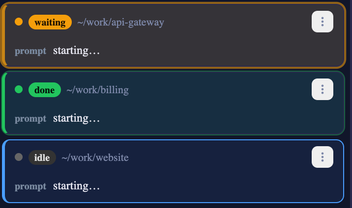

# 2.9.0 で変わったこと
{: .no_toc }

**2026-07-31 時点**のスナップショットとして書いています。挙動は動きますが、このページは動きません。
現行の説明は各セクションからリンクしているリファレンスを見てください。

- TOC
{:toc}

---

## 1 つだけ読むなら

**上げてください。全部が既定で有効で、設定は要りません。** このリリースが追加する設定は 1 つだけで、
それも最初から on です。Settings を開く理由は **off にしたいとき**だけです。

```bash
npx mulmoterminal@latest
```

| 手に入るもの | 場所 |
|---|---|
| **許可待ちで止まっている**行と、**単に終わった**行が別物に見える | ロスター・サイドバー・タブバー |
| 点滅が煩いときの **Waiting rows** スイッチ | Settings |
| ブラウザが通知音を**ブロックしている**ことがツールバーに出る | ツールバー |
| 告知できなかったセッションに、見るまで残るマークが付く | ステータスドット |
| **Antigravity** の会話がサーバ再起動をまたいで復元できる | Antigravity セッション |

| 直ったもの | 場所 |
|---|---|
| 音がブロックされている間の通知が失われる／一斉に鳴る | 通知音 |
| 非 ASCII 名のフォルダを選ぶと**既定のディレクトリ**が開く | Windows の 📁 ピッカー |
| 使えないディレクトリが無言で既定ワークスペースに差し替わる | すべてのターミナル |
| `esc-cr` ホストでスマホからスラッシュコマンドが送れない | リモートホスト |
| `esc-cr` ホストで最初のプロンプトが送信されない | Skill ボタン・コレクション |

---

## 「あなたの番」と「終わっただけ」を見分ける

セッションを並べるパネルは 3 つあります — 拡大時に出る**ロスター**、**サイドバー**、**タブバー**。
これまでは 3 つとも「注意が要る」を同じ見た目にしていました。エージェントが**許可待ちで止まっていて
あなたが答えないと進まない**場合も、**ターンが終わって未読なだけ**の場合も、同じでした。

これが色で分かれます。**アンバー = あなたの番**、**緑 = 終わった・未読**。

### ロスターでの見え方



| 状態 | 表現 | 強さ |
|---|---|---|
| 許可・質問で停止 | アンバーのリング + 左端の線 + 薄い地。**点滅する** | 強 |
| 終わって未読 | 細い緑のリング + 左端の線 + ごく薄い地。**動かない** | 弱 |
| working / idle | 変わりません | — |

**いま見ている行は対象外です。** 拡大中のセルの行は、たとえ停止中でも左端が「いま見ている」を意味する
青のままなので、読んでいるものが目の前で点滅することはありません。

### サイドバーとタブバーでの見え方

同じ区別が、working のスピナーと同じ枠に**ドット**として出ます。

- **アンバーのドット** — *Waiting for you*（あなたの番）。2.9.0 より前は、サイドバーでは**太字だけ**、
  タブバーでは**赤いドット**でした。
- **緑のドット** — *Finished — unread*（終わって未読）。どちらのパネルでも、上と区別が付きませんでした。

**太字は両方に残しています。** 太字は「注意が要る」の意味で、それは **Unread** チップが絞り込む母集団
そのものです。**どちらの種類かはドットの色が言います**。ここには点滅を入れていませんし、そのための設定も
ありません — この 2 つは常に画面に出ているので、常時動くものがあるとロスターより確実に疲れます。

### 点滅が煩いとき

1. 右上の歯車から **Settings** を開く。
2. **Waiting rows** のチェックを外す。

**色は残り、動きだけ止まります。** この設定はフォントサイズやスクロール速度と同じくブラウザの
localStorage に入るので、**デバイスごとの設定で、他の端末には同期しません**。

OS 側で視差効果を減らす設定（`prefers-reduced-motion`）にしている場合は、この設定に関わらず点滅しません。

**リファレンス:** [機能リファレンス](features.html) · [設定](config.html)

---

## 通知音がブロックされていることがツールバーに出る

ページを一度も操作していない間、ブラウザは音を鳴らしません。これは Chrome の Autoplay Policy で、
アプリ側では回避できません。MulmoTerminal 側でできるのは、**それについて嘘をつくのをやめる**ことです。


### 見分け方と、やること

- ベルの状態が 2 つから **3 つ**になりました — on / off / **ブロック中**。ブロック中はハイライトされ、
  ツールチップが *Attention sound blocked — click anywhere to enable* になります。
- **ページのどこでもいいのでクリックしてください。** ブラウザが求めているのはその 1 回だけです。
  取り逃がした通知のうち**最新の 1 件だけが 1 回鳴ります** — 以前のように全部が一斉に鳴ることはありません。

### 実際に何が壊れていたか

「あとから鳴らない」と感じていたなら、実際には「最初のクリックの瞬間に全部が重なって鳴っていた」が正確です。
音が止められている間、ブラウザはオーディオの時計を 0 で凍結しますが、保留していたビープはその時計に対して
予約され続けていました。結果、最初のクリックで全部が同一時刻に鳴り、Settings のテスト音と完全に重なるので
1 つの音と区別が付きませんでした。いまは音が動いていない間は予約しません。

### ステータスドットのマーク

告知**できなかった**セッションには、あなたが対処するまでステータスドットに未確認のリングが残ります。
**ページを読み込んだ時点ですでに待っていた**セッションも同じ扱いです — こちらは音が正常でも鳴りません。
最初の読み取りがベースラインになるためです。

リングは、そのセッションが待ち状態でなくなったとき・閉じたとき・セルを拡大したときに消えます。手で消す
ボタンは付けていません。

**リファレンス:** [スマホ通知](notifications.html) · [機能リファレンス](features.html)

---

## Antigravity の会話が再起動をまたぐ

設定は要りません。**Antigravity**（`agy`）を使っているなら、これが知っておく価値のある修正です。

`agy` は会話 id を自分で発行し、読める形ではどこにも出力しません。そのため MulmoTerminal は agy の
brain ディレクトリを監視して、セッション開始後に新しい会話を紐付けています。その対応表がこれまで
**メモリ上にしかなく**、サーバを再起動すると会話はディスクに残っているのに到達手段が消えていました。

### 直っていることの確かめ方

1. Antigravity のセッションを開始し、1 回答えさせる。
2. MulmoTerminal を再起動する。
3. そのセッションに再接続する。同じ会話の続きになります。

記録は `~/.mulmoterminal/antigravity-conversations.jsonl` に追記されます（1 セッション 1 行、セッション
キーと会話 id とディレクトリ）。このファイルを消すと、それらの会話を再開できなくなります。ただし
**別の会話に繋がることはありません** — ディスク上に存在しない id での再開は従来どおり拒否されます。

**リファレンス:** [機能リファレンス — エージェント](features.html)

---

## Windows: 非 ASCII 名のフォルダ

**Windows のみの問題です。** 📁 ボタンで、日本語・中国語・韓国語・キリル文字・アクセント付きラテン文字を
含む名前のフォルダを選ぶと、エラーも出ないまま**既定のワークスペース**でターミナルが開いていました。

ピッカーの PowerShell はパイプ出力を OEM コードページ（日本語 Windows なら CP932）で書きますが、
MulmoTerminal はそれを UTF-8 として復号していました。化けるのは非 ASCII の部分だけで、`C:\` の前置は
生き残るため、壊れたパスが「絶対パスに見える」まま通り抜けていました。

**直っていることの確かめ方:** ASCII だけではない名前のフォルダを選ぶ。そのフォルダで開きます。2.9.0 より
前は別の場所で開いていました。

あわせて、本当に使えないディレクトリのときは**そう言う**ようになりました。名指ししたディレクトリが解決
できないときに、黙って既定ワークスペースに差し替わることはなくなります。

**リファレンス:** [設定](config.html)

---

## `esc-cr` ホスト: スラッシュコマンドと最初のプロンプト

**`terminalSubmit: "esc-cr"` を設定しているホストだけの話です。** 設定した覚えがなければ読み飛ばして
ください。

2 つの行き止まりが直りました。

- **スマホからのスラッシュコマンド。** `/command` や `@path` の末尾にカーソルがある間、Claude Code は
  補完メニューを開いたままにし、その状態では `escape` がメニューの dismiss になります。そのため
  `ESC CR` の submit の ESC が食われ、行が入力欄に残っていました。普通の文章は影響を受けないので、
  「submit が壊れている」ではなく「スキルが壊れている」ように見えていました。同じ行き止まりがブラウザの
  **Skill** メニューにもあり、両方直しています。
- **最初のプロンプト付きで起動したセッション。** Skill の起動ボタンやコレクションの操作は初期プロンプト
  付きでセッションを起こしますが、それを打ち込むサーバ側の経路が `\r` を直書きしていました。`esc-cr`
  ホストでは `\r` は改行であって送信ではありません。

**直っていることの確かめ方:** そのホストで Skill ボタンを押す。入力欄に残らず送信されます。

**リファレンス:** [設定 — terminalSubmit](config.html)

---

## ほかにやることはありません

上のすべてはアップグレードすれば有効です。このリリースでは内部が大きく動きました — Settings、
リモートホストのハンドラ、グリッドの起動フォーム、wiki の描画がそれぞれ分割され、ファイルが黙って
600 行を超えたり参照されなくなったりしないようガードレールが 2 つ入りました — が、見た目は変わりません。

おかしいと感じたら、どのセッションでもいいので `/mulmoterminal-bug-report` と打ってください。同梱の
スキルが実際の設定とバージョンを読み、設定の問題か仕様かを判断し、既存の issue を検索し、どれでも
説明が付かないときにだけ起票を手伝います。
