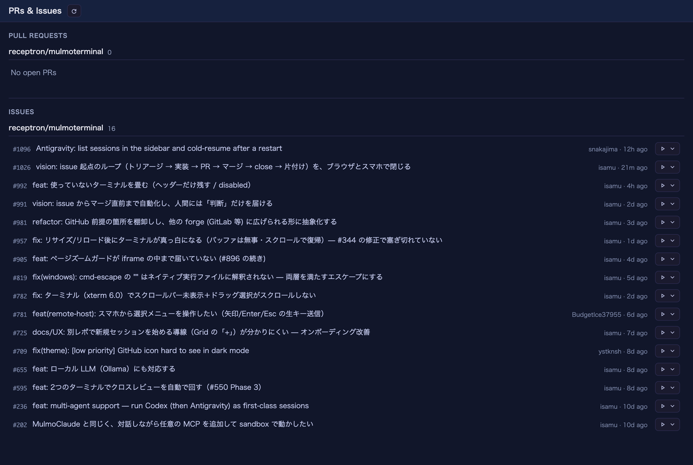
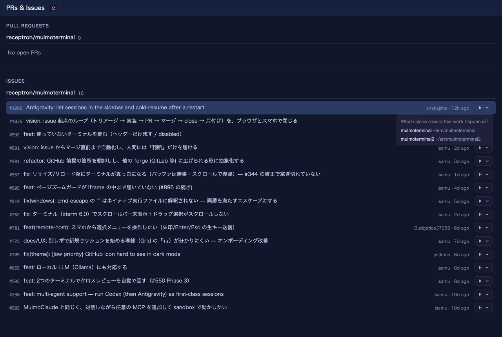

# 3.0.0 — issue から始める

**2026-07-31 にリリースした 3.0.0 のスナップショットです。** アプリが進めば内容は古くなります
（それは想定どおりです）。常に最新が保たれている情報は、各節から生きたガイドへリンクしています。

これまで **PRs & Issues** ビューは「**読む**」場所でした。3.0.0 からは「**始める**」場所になります。
issue の行のボタン1つで、その issue の worktree を切り、そこで Claude を、**issue を入力欄に入れた
状態で**開きます。

**既存の設定は何も変わりません。** 必須の設定キーはなく、CLI のフラグも動いていません。
今まで使っていたものはそのまま動きます。アップグレードすればボタンが増えるだけです。

---

## 先に必要なもの

2つだけで、どちらも既にある人が多いはずです。

1. **そのリポが Settings → Pull request repos（`prRepos`）に登録されていること**。登録が無いと
   issue 自体が一覧に出ません。→ [GitHub 連携](github.html)
2. **そのリポのローカルクローンがあり、ディレクトリプリセットに登録されていること**。
   ボタンはそこで作業を始めます。クローンが無い場合、ボタンは**無効になって理由を表示します** —
   押してから失敗するのではなく、押す前に本当のことを言います。

サーバを動かすマシンで `gh auth login` が済んでいることも必要ですが、これは issue 一覧の時点で
既に必要だったものです。

## 使い方

1. ツールバーの **Pull requests** を開く。
2. **Issues** セクションで issue を見つける。
3. 行末の **▶** を押す。

*どの issue 行にも **▶** が付きます。他は今までどおりで、行そのものは GitHub を開くので、
ボタンはリンクを置き換えず横に並びます。*

これだけで、以下が全部行われます。

- issue を読み（タイトルと本文）、
- **`issue/<番号>-<slug>`** という名前のブランチで worktree を作り（**fetch したうえで
  `origin/<ベースブランチ>`** から分岐）、
- その worktree で **Claude** をグリッドのセルとして開き、**issue を入力欄に入れた状態**にする。

**送信はされません。** 読んで、必要なら直して、Enter は自分で押します。本文は**その issue を書いた
人**——たいていあなたではない——のテキストなので、Enter は意図的にあなたの操作にしてあります。

### 新しい worktree では、初回だけ Claude が「このフォルダを信頼するか」と聞きます

これは Claude Code 自身の確認で、アプリが作った直後の worktree は Claude が見たことのない
ディレクトリだからです。**1. Yes, I trust this folder** を選べば、少ししてから issue が入力欄に
出てきます。アプリはダイアログに打ち込まず、あなたが答えるのを待ちます。

### 同じリポのクローンを複数並べている場合

初回だけ「**どのクローンで作業するか**」を聞き、その答えを覚えます。以降はそのリポのどの issue でも
1クリックです。

*聞かれるのはリポごとに1回だけ。候補は各クローンが宣言した順に並び、答えは記憶されるので、
そのリポで最初に着手するときだけ出て、次からは出ません。*

選択は `~/.mulmoterminal/config.json` の `repoDirs` に保存されるので
（→ [設定](config.html)）、手で書く必要はありません。

候補の並び順は、各クローンの `.mulmoterminal.json` が宣言する `orderPriority` 順、未設定のものは
パス順です。ランチャーのディレクトリチップと同じ並びです。

## 効いているかの確かめ方

- セルヘッダーのブランチチップが **`⎇ issue/<番号>-…`** になっている。
- そのセルの **⧉ Open PR** が、PR 本文に **`Fixes #<番号>`** を入れる。だから PR をマージすれば
  issue が閉じます。自分で書き足すのを覚えておく必要はありません。
- ブランチ名に番号が載っているので、ヘッダーの work item チップが**推測せずに** issue を見つけます。

## いま有効にしておくと良いもの

**Issue work comments**（`issueWorkComments`、既定 off）が、このリリースで実用度が上がりました。
作業開始時と PR マージ時に issue へコメントし、マージ時に issue を閉じることもできます。
以前は「アプリがそのブランチの issue をたまたま割り出せたとき」に依存していましたが、
いまはブランチが番号を持っているので**毎回繋がります**。→ [GitHub 連携](github.html)

GitHub に書き込むもので、しかも他人の issue であることが多いので、opt-in のままにしています。

## 3.0.0 のその他

**見なくていいターミナルを沈める。** セルヘッダーの月ボタンで、そのセルを薄くします（タイル・
フィルムストリップのサムネイル・コックピットロスターの行）。作業中ドットの拍動も止まります。
**セッション・接続・履歴はそのまま**で、リロードをまたぎます。起こすのはターミナルへの文字入力で、
拡大では起きません（拡大は「起こさずに読む」ための操作だからです）。許可待ちのセルは沈まず、
沈んだセルがターンを終えても沈んだままです。

これまでの回避策は、静かにしたいセルで `/clear` を打つことでした。**見た目を変えるために会話を
リセットしていた**わけです。

**知っておくと良い修正が2件:**

- 拡大したセルが、沈めていた（パーク時の）幅のまま描画され、リロードするまでターミナルのサイズが
  凍ったままになることがありました。修正済みで、操作は不要です。
- コックピットロスターで `done` の行にポインタを載せると背景が純白になり、緑の状態色が消えて
  いました。どのテーマでも色が残るようになりました。

---

設定不要のものも含めた全変更の詳細は
[チェンジログ](https://github.com/receptron/mulmoterminal/blob/main/docs/ChangeLog.md)にあります。
