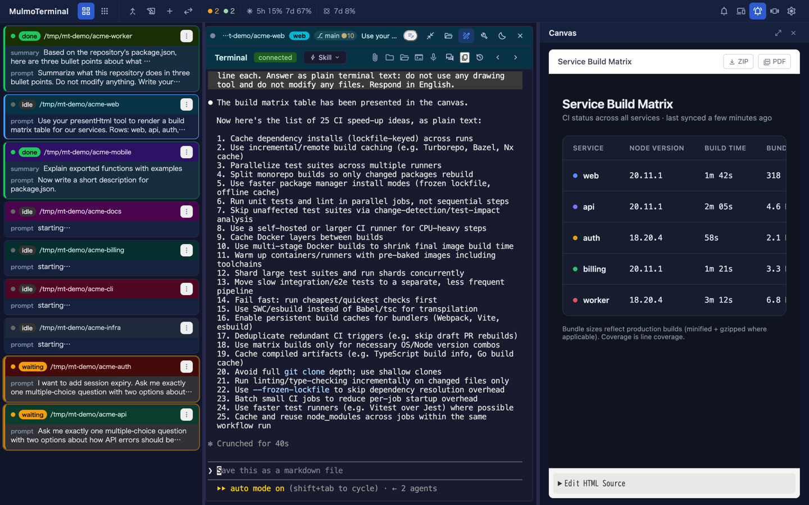
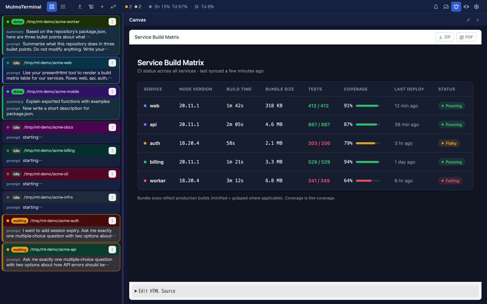
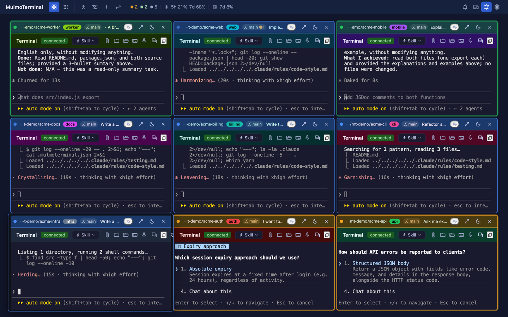

# 4.2.0 — セルフホストの GitLab、端末いっぱいに広がるペイン、色を引き継ぐ worktree

**2026-08-03 リリース時点の 4.2.0 のスナップショットです。** アプリが進むにつれて古くなりますが、
それは想定どおりです。常に最新に保たれるリファレンスは、各節からリンクしている生きたガイドを
参照してください。

```bash
npx mulmoterminal@latest
```

**設定が要るのは 1 つだけ** — セルフホストの GitLab です。これは推測できないので、宣言する必要が
あります。それ以外はアップグレードすれば動き出します。

---

## 社内 GitLab を PRs & Issues に表示する

これまで MulmoTerminal が読めるのは github.com と gitlab.com の 2 つだけでした。
`gitlab.yourcompany.com` の行にはそう書かれた 1 文が出るだけで、そこで終わりです。そもそも
「そのホストが GitLab である」ことを伝える手段がありませんでした — セルフホストのインスタンスは、
見ただけでは他のドメインと区別が付かないからです。

なので、宣言します。`~/.mulmoterminal/config.json` を開いて **`gitlabHosts`** を足してください。

```json
{
  "gitlabHosts": ["gitlab.yourcompany.com"],
  "prRepos": ["gitlab.yourcompany.com/group/project"]
}
```

キーは 2 つで、役割が違います。`gitlabHosts` は「このドメインは GitLab である」と伝えるもの。
`prRepos` は **PRs & Issues** ビューが読むリポジトリの一覧で、すでにお使いかもしれません — 同じ
一覧に、パスの前へホストを付けた形です。

**手でファイルを編集したらサーバを再起動してください。** ホスト一覧はサーバがメモリ上に保持して
いる設定から読むため、Settings 経由の変更は即座に反映されますが、手書きした `config.json` は起動
時にしか読まれません。`prRepos` が以前からそうであるのと同じ規則です。

**効いたかどうかの確かめ方。** **PRs & Issues** ビューを開きます。以前はそのホストの行にこう出て
いました。

> `gitlab.yourcompany.com is not supported yet — MulmoTerminal reads github.com and gitlab.com`

これがマージリクエストと issue の一覧に変わります。まだキーを足していない場合も、**このメッセージ
自体がどのキーをどこに足せばよいかを案内する**ように書き直されているので、手探りになりません。

宣言したホストは、そのあと gitlab.com と同じ経路を通ります — 横断一覧、issue からの着手、着手時
とマージ時の作業コメント、**Open PR** ボタンからのマージリクエスト作成まで。

**`glab`（GitLab の CLI）が必要**で、あなたのインスタンスにログイン済みである必要があります。
`npx mulmoterminal doctor` が入っているか確認します。GitHub には引き続き `gh` が必須で、`glab` は
GitLab のリポジトリを使うまでは任意です。

**まだ対応していないもの。** ポート付きのホスト（`gitlab.example.com:8443`）は書けません —
`prRepos` のエントリにコロンを置く場所が無いためです。http のみのインスタンスと GitHub Enterprise
も同様です。なお `github.com` は値として**意図的に拒否**しています。書き間違えやすく、間違えた
ときの被害が大きいためです。

この設定の画面はまだありません。今のところ設定ファイルがすべてです。

生きたガイド: [GitHub と GitLab](github.html) / [設定](config.html)

---

## Canvas と Tools を端末領域いっぱいに広げる

Canvas に描いたドキュメントは、これまで端末の横に残った幅の中で表示されていました。横に広い表、
Marp のスライド、レンダリングしたページには、それでは足りません。

**セッションを拡大し、Canvas を開いて、ペインのヘッダーにある拡大ボタンを押してください** —
ペイン上部の `open_in_full` アイコンです。ペインが行を丸ごと取ります。もう一度押す
（`close_fullscreen`）と分割に戻ります。





**Tools** ペインにも同じボタン対が同じ位置にあります。1 つのスロットを共有する 2 つのペインなので、
覚えるのが一度で済むことがそのまま狙いです。

**何を覆い、何を覆わないか。** 覆うのは拡大中の端末だけです。左のコックピットロスターと下の
フィルムストリップはその行の外にあるので、まったく動きません。ドキュメントを全幅で開いたままでも、
他のセッションの様子は見えたままです。下の端末は破棄されず、実サイズのまま画面外へ退避するので、
戻したときの形も変わりません。

**記憶しません。これは意図的です。** ペインを閉じて開き直すと、毎回かならず分割表示から始まります。
別のペインに切り替えても、リロードしても同じです。端末を覆うペインは、それを求めた瞬間以外はいつも
不意打ちで、しかも隠すのは作業中のものそのものだからです。どのペインが開いていたか、分割時の幅が
いくつだったかは、従来どおり記憶します。

Canvas ヘッダーの右端には **Close** が増えました（Files / Tools と同じ形です）。以前あった tools
ボタンは無くなりましたが、Tools ペインは各セルのヘッダーから引き続き開けます。

生きたガイド: [基本](basics.html)

---

## 新しい worktree がプロジェクトの色を引き継ぐ

`.mulmoterminal.json` は通常 gitignore されているため、`git worktree add` で作ったディレクトリには
**設定が 1 つも入っていません**でした。セルはプロジェクトの色も、名前バッジも、モデルも、グリッド
での順位も失い — 順位が無いので並び順の最後尾へ落ちます。同じプロジェクトの 3 つのセルが、無関係な
3 つに見えていました。

**有効化の操作は要りません。** これまでどおり worktree を作れば（ランチャの **＋ New worktree**、
または issue からの着手）、設定が入った状態で出てきます。

- `name` / `theme` / `colors` / `fontSize` / `fontFamily` / `provider` / `model` はそのまま複製。
- 7 つのクローム色は、**worktree ごとに色相環を 12 度ずつ**回します。プロジェクトとその worktree
  たちが、複製ではなくグラデーションとして読めるようにするためです。動かすのは色相だけで、彩度と
  明度はその色が選ばれた理由（コントラスト）を担っているので触りません。`headerTextColor: "#ffffff"`
  のようなグレーは回す色相を持たないので、特別扱い無しでそのまま残ります。
- `orderPriority` はプロジェクトの順位 **+ 1**。切り出し元のプロジェクトの直後に並びます。

**3 つのキーは意図的に引き継ぎません**: `sound` / `sounds` / `addDirs`。いずれもプロジェクト
ディレクトリ内のパスを指しており、worktree にはその実体がありません。とくに `addDirs` はファイルが
置かれたディレクトリを基準に解決されるため、複製すると黙って別のフォルダ群を許可することになります。

**worktree にすでに設定がある場合、上書きはしません。** また、書き込むのは git が無視する場所に
限っています。worktree の `git status` に未追跡ファイルが出るのは単に散らかるだけでなく、
MulmoTerminal は **dirty な** worktree の削除を拒否するので、アプリが自分で書いたファイルのせいで
自分の後片付けを止めてしまうためです。

生きたガイド: [シナリオ](scenarios.html)。プロジェクトの色をそもそも決める話は `mulmoterminal-dirs`
スキルへ。

---

## 完了したターンは、どこでも緑

4 つの注目状態は 2 か所で描かれています — グリッドのタイルは自分のクロームを描き、コックピットの
ロスター行は自分のものを描きます — そして、そのうち 1 つで食い違っていました。`done` がタイルでは
テーマの**アクセント**、ロスター行では**緑**だったのです。

代償は 2 つありました。`working` も同じアクセントなので、実際にグリッドを眺める距離では 2 つの青が
見分けにくいこと。そして、セッションを拡大すると「これは終わった」の色が目の前で変わってしまうこと。

これが **working = 青 / done = 緑 / waiting = 琥珀** に、すべてのビューで揃いました。設定は不要で、
グリッドを開けばそれが見えます。ロスターは変わっていません — 他が、ロスターの緑に合わせた形です。



生きたガイド: [基本](basics.html)

---

## 入力を受け付けなくなった端末

椅子に座っている側からは同じに見える 2 つの別々の不具合があります。打っても何も起きない、という
状態です。

**1 つ目は、自分で直るようになりました。** xterm にはリサイズで書き込みキューが永久に詰まる未修正の
バグがあり、打鍵はシェルまで届いているのに、返ってきたものが二度と描画されません。直す仕組み自体は
すでにありましたが、呼ばれるのはリサイズ時と出力フレーム受信時だけで、**アイドルの**セルはその
どちらも受け取りません。いちばん修理が必要なセルが、いちばん修理を頼めない状態でした。打鍵が 3 つ
目のトリガーになったので、あなたが目の前で打ち込んでいるセルは自分で直ります。

**2 つ目は、理由を言うようになりました。** ソケットが落ちている間（再接続中、またはセッションが
superseded になったあと）の打鍵は、これまで何も言わずに捨てられていました。バナーで伝えます。
切断がバナーの表示時間を超えて続く場合は再表示します。再接続は上限付きで無限にリトライするため、
1 回の切断が数時間に及ぶことがあり、以前のバナーは最初の一度しか喋らなかったからです。

これは**ヘッダーのボタンと Skill メニュー**にも届きます。以前は切断中に押しても何も起きず、理由も
出ませんでした。

**修正が入っているかの確かめ方。** セッションを開いたままサーバを止めて、ヘッダーのボタンを押して
みてください。無言ではなく、「送ったものが破棄された」というバナーが出るはずです。

生きたガイド: [FAQ](faq.html)

---

## そのほか

いずれも操作は不要ですが、リリースの大半はこちらです。

- **`gui-chat-protocol` 2.0.0** と、それに合わせた `@mulmoclaude/*` プラグイン一式。
- **unsafe な `any` の指摘 407 件がゼロ**になり、それを禁じるルールが error になったので、もう戻って
  きません。`noUncheckedIndexedAccess` も有効化。`as` の禁止が Vue テンプレートにも届くようになり
  ました — 設定されていたのに一度も報告されていなかった場所です。
- **`yarn typecheck` がリポジトリ全体を見るようになりました。** これまでは 5 つのうち 2 つの
  プロジェクトしか見ておらず、server と test はまったく検査されていませんでした。
- **テストが速く・安定に**: サーバ系 153 本が使いもしないブラウザ環境を立てるのをやめ、ファイルの
  最初のテストが対象モジュールの読み込み代を払わされるのをやめました。

PR 単位の詳細は [changelog](https://github.com/receptron/mulmoterminal/blob/main/docs/ChangeLog.md)
にあります。
