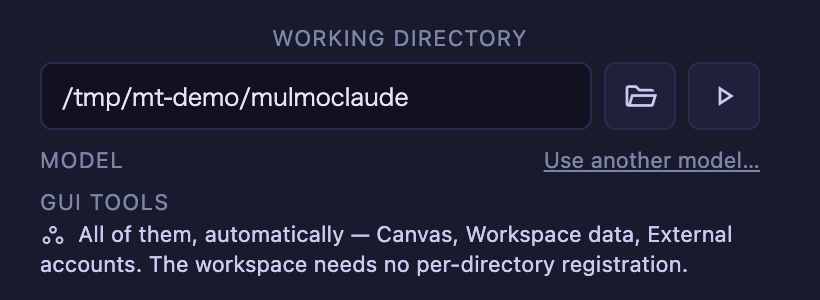
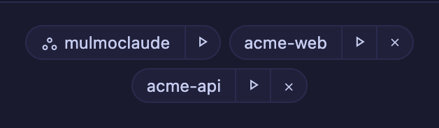

# 4.3.0 — ワークスペースがひとつの場所になり、Enter が変換確定に戻る

**2026-08-04 リリース時点の 4.3.0 のスナップショットです。** アプリが進むにつれて古くなりますが、
それは想定どおりです。常に最新に保たれるリファレンスは、各節からリンクしている生きたガイドを
参照してください。

```bash
npx mulmoterminal@latest
```

**設定が要るものはありません。** すべてアップグレードすれば動き出します。ただし**ツール名の変更**
だけは、知らないと不具合に見えるので読んでおいてください。

---

## ワークスペースなら、どの起動方法でも同じツールに届く

**ワークスペース**とは MulmoTerminal 自身が作業対象にしているディレクトリ（既定では
`~/mulmoclaude`）のことで、**ディレクトリごとの登録なしにすべての GUI ツールが使える唯一の場所**です。

これは **claude セル**では正しく動いていました。それ以外では違いました。**同じワークスペース
ディレクトリ**なのに、起動方法だけで持ちツールが変わっていました。

| 起動方法 | 変更前 | 変更後 |
|---|---|---|
| claude セル | 全ツール | 変更なし |
| codex セル | そのディレクトリに登録済みのグループだけ | **全ツール** |
| ランチャーチップ `claude` | **何もなし** — Canvas が出ない | **全ツール** |
| ランチャーチップ `codex` | 登録済みグループだけ | **全ツール** |
| その他のチップ | 素通し | 素通し |

隣のセルには Canvas があるのに自分には無い、ということが「どのエージェントで起動したか」だけで
起きていました。

**有効化の操作は要りません。** ワークスペースを指定すると、ランチャーが何を持つか教えてくれます。



**代償が 2 つあります。隠さず書いておきます。**

- **codex の承認はツール単位ではなくサーバー単位です。** ワークスペースの codex セッションでは、
  外部アカウント（Google / X）や課金の発生する生成ツールを含めて**一括で自動承認**されます。同じ
  ディレクトリの claude セッションでは以前からそうなっており、揃っていなかった方が直った形です。
- **ランチャーチップの `claude` は `--strict-mcp-config` 付きで起動します。** そのターミナルでは
  **あなた自身の MCP サーバー（`.mcp.json`）が読まれません**。チップとセルで持ちツールが変わるのを
  避けるための代償です。ワークスペースで自前のサーバーを使いたい場合は、チップではなくセルとして
  起動してください。

生きたガイド: [設定](config.html)

---

## ランチャーが常にワークスペースを出す

チップ一覧は、これまで「最近使ったディレクトリ」そのものでした。この一覧は起動のたびに自動記録
されるもので、ユーザーが × で消せます。つまり**アプリで最も重要なディレクトリが、一度もそこで
起動していなければ存在せず、一度 × を押したら二度と出てこない**状態でした。

常に先頭に出るようになりました。



- **常に先頭**。`orderPriority` による並び順の外側です — あれはあなたが設定したディレクトリ同士の
  順位で、ワークスペースはその競争に参加していません。
- **専用アイコン**が付き、**× は出ません**。合成されたエントリなので消すものが無く、消しても次の
  描画で戻ってきます。
- すでに一覧にある場合は**重複せず**、**あなたが付けたラベルもそのまま**です（ワークスペースに
  なったせいで名前が変わることはありません）。

枠と背景は意図的に変えていません。あれは既に「ここでセッションが走っている」という意味を持って
いるためです。

生きたガイド: [基本](basics.html)

---

## エージェントに見えるツール名が短くなり、ディレクトリで変わる

**知らないと不具合に見える**のはここです。

MCP クライアントはツール名を必ず**サーバー ID で修飾**します。ワークスペース / 単一ビュー用の
サーバー ID が `mulmoterminal-gui` から **`mt`** になりました。

| クライアント | 変更前 | 変更後 |
|---|---|---|
| Claude Code | `mcp__mulmoterminal-gui__presentChart` | `mcp__mt__presentChart` |
| Codex | `mcp-mulmoterminal_gui-presentChart` | `mcp-mt-presentChart` |

この ID は**ツール 1 個につき 1 回、リスト表示のたびに、セッションが終わるまで**繰り返されます。
17 文字かけて、周囲の設定がすでに言っていることを言い直していました。

**変わったのはこの ID だけで、次の非対称性は意図的です。**

| | ワークスペースのセル / 単一ビュー | プロジェクトディレクトリのセル |
|---|---|---|
| ツール名 | `mcp__mt__presentChart` | `mcp__mulmoterminal-render__presentChart` |
| ID の所有者 | こちら（spawn ごとに生成、どのファイルにも残らない） | **あなた**（自分で書いた `.mcp.json` のキー） |

グループ単位の ID は**あなたの設定ファイルのキー**そのもので、ランチャーのグループ切り替えも
そこを読み戻します。改名すると**エラーも出ずに**既存のセットアップが効かなくなるので、触って
いません。両方の綴りを見かけても、壊れてはいません。

**やることはありません。** `mulmoterminal-gui` はアプリが spawn ごとに生成していたもので、あなたの
設定には書かれていません。Antigravity の設定に古いエントリが残っていても、引き続き認識して
片付けます。

生きたガイド: [設定](config.html)

---

## Enter が変換確定に戻る

日本語（および中国語・韓国語）で書く方には、これが目当てのリリースです。

**セッションメモ**（セルヘッダーの鉛筆）で、「れびゅー」→変換→「レビュー」が未確定の状態で Enter を
押すと、**変換前のまま保存されて入力欄が閉じて**いました。1 回目の Enter で閉じるので取り返しが
つかず、毎回間違ったメモが残っていました。

**Escape も同じ問題**を抱えており、しかもこちらの方が被害が大きいものでした。変換中の Escape は
「候補を取り消す」操作なのに、**書きかけのメモごと消えて**いました。

**ターミナル**でも、Safari に限り、同じ Enter が**半端な行をエージェントに送信**していました。

**有効化の操作は要りません。** 日本語で入力して変換し、Enter を押してください。1 回目は変換確定に
使われて入力欄は開いたまま、2 回目で保存されます。

**なぜ Safari だけ名指しなのか。** Safari は `compositionend` を確定 keydown **より先に**発火する
ため、通常の `isComposing` 判定はその時点で既に false です。Chrome / Firefox は逆順なので、
ターミナル側では問題が見えていませんでした。現在はどちらも対応済みです。

生きたガイド: [FAQ](faq.html)

---

## そのほか

操作は不要ですが、リリースの大半はこちらです。

- **テストが `$TMPDIR` に一時ディレクトリを残さなくなりました** — 1 回のフルテストで 51 個 → 0 個。
  発見時のマシンには 42,000 個溜まっていました。
- **3 つのファイルがどの TypeScript プロジェクトにも属さず**、`yarn typecheck` にも CI にも
  検査されていませんでした。現在は追跡 1,173 ファイルすべてが被覆されています（3 ファイルそれぞれに
  型エラーを仕込んで検出されることを確認済み）。
- **ドキュメントを検索語で名乗り直し**（中身は元からありました）、README に**どのセルも本物の pty**
  であることを明記しました — これが「worktree の 1 セッション制限がエージェントにしか掛からない」
  理由の説明になります。hero GIF も撮り直しています。

PR 単位の詳細は [changelog](https://github.com/receptron/mulmoterminal/blob/main/docs/ChangeLog.md)
にあります。
