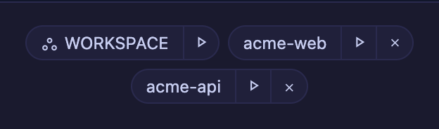

# 4.3.1 — ワークスペースのチップが WORKSPACE と名乗る

**2026-08-04 リリース時点の 4.3.1 のスナップショットです。** アプリが進むにつれて古くなりますが、
それは想定どおりです。常に最新に保たれるリファレンスは、各節からリンクしている生きたガイドを
参照してください。

```bash
npx mulmoterminal@latest
```

**設定は不要です。** [4.3.0](v4.3.0.html) と同じ日に出す磨き込みのリリースで、中身はラベル 1 つと、
ヘッダーのチップの裏にあった不具合 1 つです。4.3.0 のページをまだ読んでいなければ、先にそちらを
読んでください。ここはその続きです。

---

## ワークスペースのチップが役割名で名乗る

4.3.0 で、ランチャーは常にワークスペースを先頭のチップとして出すようになりました。ただしその
ラベルは**フォルダ名**（`mulmoclaude`、あるいは `CLAUDE_CWD` の指す名前）でした。

それはそのディレクトリについて言えることの中で**いちばんつまらない事実**で、しかも並んでいる
プロジェクトの 1 つに見えてしまいます。他のチップはすべて**場所**（起動したことのある
ディレクトリの basename）ですが、これだけは**役割**です — セッションが作業の拠点にする場所、
全 GUI ツールが届く唯一のディレクトリ、共有の wiki / collections / accounting があるところ。

なので、そう名乗るようにしました。



**やることはありません。** アップグレードすればチップの名前が変わります。

- **大文字**にしているのは、隣が全部小文字の basename だからです。ディレクトリ名として読まれない
  ための区別も兼ねています。
- **あなたが付けたラベルより優先されます。** 4.3.0 では「すでに一覧にあるワークスペースはあなたの
  ラベルを保つ」としていましたが、このチップに限っては役割の方が言う価値があるので、役割が勝ちます。
- **実際のパスは hover に残ります。** 他のチップと同じ場所です。
- **読み上げはラベルと別**です。他のチップはディレクトリ名を読めば行き先が分かりますが、このチップは
  役割名なので行き先を言っていません。`the workspace, <パス>` と読み上げます。

生きたガイド: [基本](basics.html)

---

## git チップがタブに戻ったときに更新される

小さな話で、気づいていなかったかもしれません。ただ、ヘッダーが静かに信用できなくなる類の問題です。

ブランチ / 変更あり / ahead-behind のチップは、**ウィンドウ**がフォーカスを取り戻したときに更新して
いました。ブラウザの**タブ**の切り替えは別のイベントを発火しますが、そちらは聞いていませんでした。
そのため MulmoTerminal のタブに戻っても、次の 10 秒 tick が来るまで、離れたときのブランチが表示され
たままでした。

隣の PR チップはすでに対応済みだったので、**両方が 1 つの実装を共有する**形にしました。今後この 2 つ
が食い違うことはありません。

**修正が入っているかの確かめ方。** 別のタブに移り、アプリの外のターミナルでブランチを切り替えてから
戻ってみてください。10 秒後ではなく、戻った時点で正しくなっているはずです。

生きたガイド: [基本](basics.html)

---

詳細は [changelog](https://github.com/receptron/mulmoterminal/blob/main/docs/ChangeLog.md) にあります。
