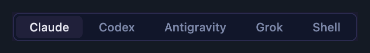
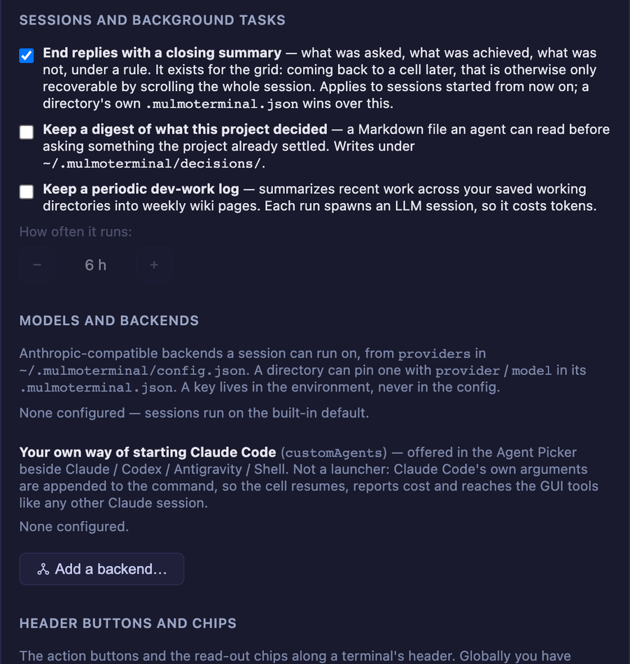

# 4.5.0 — 設定するもの

**2026-08-05 に書いたスナップショットです（MulmoTerminal 4.5.0）。** ここに書いた挙動はその日に
出荷されたものです。最新の内容は [設定](config.html) を見てください。

このリリースで設定するものは4つあります。順に説明します。

| | |
|---|---|
| [リポジトリ自身のアイコンと色](#repo-json) | `repo.json` — どのツールからも読める1ファイル |
| [worktree ごとのポートと DB 名](#worktree-env) | 2つの `yarn dev` が 3000 を取り合わなくなる |
| [Grok と、自分で書くエージェント](#agents) | Agent Picker が増えました |
| [触れるようになった設定](#settings) | JSON 手書きでしか設定できなかった12キー |

## リポジトリ自身のアイコンと色 {#repo-json}

同じ灰色のセルが9つ並び、見分ける手段はパスを読むことしかない。4.5.0 は、リポジトリが自分で
「これは何か」— 名前・マーク・色 — を、**どのツールからも読めるファイル**で言えるようにします。


*ヘッダー左端のマークはリポジトリ自身のものです。どちらのセルも MulmoTerminal 側では何も設定して
いません。*

### 手順（これだけ）

リポジトリのルートに `repo.json` を置きます。

```json
{
  "name": "diffusion-lab",
  "description": "Training and evaluation for latent diffusion models",
  "icon": "docs/logo.png",
  "color": "#7c3aed"
}
```

保存すると**セルは即座に色を変えます**。再起動もリロードも不要です（エージェントの Write/Edit
ツールが書いた場合）。外部から手で編集したときは次のリロードで反映されます。

手順は以上です。以降は各フィールドが何をするかの説明です。

### 各フィールドで何が変わるか

| | |
|---|---|
| `name` | セルヘッダー・ロスター行・ランチャチップのバッジ |
| `icon` | ヘッダーの**左端**のマーク。ブラウザのタブと同じ位置で、最初に目が行くところだからです。ロスター・フィルムストリップ・ランチャチップにも出ます |
| `color` | **7色すべて**。下記 |
| `description` / `homepage` / `authors` | MulmoTerminal は今のところ表示しません。オープン規格の一部で、他のツール向けです |

#### 1色が7色になる

書くのは1色です。ヘッダーはその色そのもの、バッジ・枠・ステータスドット・ボタン・セル本体はその
色相から導出され、ヘッダーの文字色は**コントラストから導出**されます（宣言しないので、どんな色を
選んでも読めます）。

3つの役割で書くこともできます。

```json
"color": { "primary": "#7c3aed", "accent": "#22d3ee", "background": "#0b1020" }
```

`background` はセル本体を直接指定します。`accent` は規格にはありますが、MulmoTerminal には当てる
先がまだありません。

**`#rgb` と `#rrggbb` のみ。** `"blue"` や `rgb(1,2,3)` は無視されます。無視の仕方も安全で、
使えない色は**導出した色をそのまま残します**（セルが色無しになりません）。

#### アイコン

文字列か、複数サイズを持つときは配列です。

```json
"icon": [
  { "src": "docs/logo.svg", "sizes": "any" },
  { "src": "docs/logo-192.png", "sizes": "192x192" }
]
```

ベクタが最優先、次に最大のもの、同点なら先に書いた方。**解決できない要素は飛ばします** — 死んだ
パスが1つあっても、後続の使えるアイコンを隠しません。

PNG / JPEG / **アニメ GIF** / WebP / AVIF / SVG / ICO / BMP。パスは `repo.json` からの相対で、
リポジトリの外には出られません。`http(s)` の URL や `data:` 画像も使えます。

### favicon があるなら、何も書かなくてよいかもしれません

どこにも icon を設定していないディレクトリは、**リポジトリが既に持っている favicon** を表示します
（`public/favicon.svg` / `apple-touch-icon.png` / web manifest）。4.5.0 から既定で有効で、設定は
要りません。切るときは 設定 → **Directory appearance**、プロジェクト単位なら `"icon": false`。

### 自分の設定を上に載せる

`repo.json` は**一番下**の層です。その上の2つはこれまでどおりです。

```
repo.json  →  .mulmoterminal.json  →  .mulmoterminal.local.json
プロジェクト     あなたの設定           この checkout
```

プロジェクトのブランド色は、あなたが上書きするまで効きます。上書きすれば自分の配色が勝ちます。
オープン規格に無い MulmoTerminal 固有のもの（`theme` / `orderPriority` / `sound` など）は、
`repo.json` の中の `extensions.mulmoterminal` か、上の2ファイルに書きます。


*チップにも出るので、起動する前にどこで起動しようとしているか分かります。*

### 効いたかどうかの確かめ方

**設定 → Directory settings** でプロジェクトを開くと、読んだファイルが**適用される順に**すべて
名前で出て、どのキーがどのファイルから来たかが分かります（`color` から導出した色も含みます）。
書いた値と違うものが出ているときは、どの層が勝ったのかがここで分かります。

### うまくいかないとき

- **何も書かなければ何も起きません。** 全フィールドが任意で、空の `repo.json` も正当です
- **リポジトリの外へ出るパスは拒否されます。** `../../elsewhere.png` は何も表示しません
- **書いたけれど間違っているアイコンは、favicon にフォールバックしません。** 意図的です — 壊れた
  設定は壊れて見えるべきなので。設定 → Directory settings で「落とされたキー」として出ます
- **Mac で特別なことは要りません。** 権限も再起動も不要です

### 規格そのものについて

`repo.json` は MulmoTerminal のファイルではありません。[仕様](../../repo-json.html)は、
リポジトリを一覧・表示するあらゆるツール（ターミナル・IDE のタブ色・プロジェクトスイッチャ・
ダッシュボード）が読めるように書かれています。リポジトリが一度だけ自分の素性を述べ、どのツールも
同じ答えを出す、というのが狙いです。

リポジトリを持っているなら、4行足すコストはこのアプリだけのためではありません。

## worktree ごとのポートと DB 名 {#worktree-env}

git worktree はファイルを隔離します。しかし**ポートは隔離しません**。片方のツリーで `yarn dev`、
もう片方でも `yarn dev` とやると、2つめは 3000 を取れずに落ちます。ローカル DB も同じで、5つの
ツリーが同じ DB を見ていれば、migration を走らせた1つが残りを壊します。

「各ツリーが自分専用に持つべきもの」をプロジェクトの `.mulmoterminal.json` で宣言します。

```json
{
  "worktreeEnv": {
    "PORT": { "kind": "port", "base": 3000 },
    "DB_NAME": { "kind": "slug", "prefix": "acme_" }
  }
}
```

MulmoTerminal がツリーごとに重複しない値を予約し、**そのツリーの全ターミナル**（Claude セル /
Codex セル / Shell / launcher / Run コマンド）に環境変数として渡します。dev スクリプト側は何も
変えません。これまでどおり `PORT` を読むだけです。


*ヘッダーの `env` チップ。`:3010` はリンクで、クリックするとそのツリーの dev サーバが開きます。*

### 各ツリーが受け取るもの

| kind | 配られる値 |
|---|---|
| `port` | `base` → `base + 10` → `base + 20` …。**刻みは 10** です。Vite などは指定ポートが埋まっていると勝手に次のポートへ逃げるので、1刻みだとその逃げ先が隣のツリーの枠に着地します |
| `slug` | `prefix` + そのツリーのタスク名を識別子として安全にしたもの — `acme_fix_login` |

チェックアウト本体が最初の値（`3000` / `acme_proj`）を受け取るので、本体だけ特別扱い、にはなりません。

**ポートの空き確認は「初回に配るときだけ」**です。毎回やると自分自身の dev サーバから逃げ続けて
しまいます。予約は `~/.mulmoterminal/worktree-env.jsonl` に残ります。

### 効いているかの見分け方

セルヘッダーの `env` チップです。既定のチップですが、`worktreeEnv` を宣言していないプロジェクト
では**何も描画しません** — チップが出ないなら設定が読まれていません。生の値が見たいときは、
そのツリーのターミナルで `echo $PORT`。

## Grok と、自分で書くエージェント {#agents}



**Grok** が4つめの一級エージェントとして加わりました。空のセルで選べば本物のセッションになり、
リロードやサーバ再起動をまたいで再開し、そのディレクトリが登録した GUI MCP ツールを持ち、タブ
バーにバッジも出ます。設定は要りません — `grok` CLI が PATH にあれば出ます。

### Claude Code の起動のしかたを自分で書く

Picker には**自分で書いたコマンド**も並べられます。`~/.mulmoterminal/config.json` に:

```json
{
  "customAgents": [
    { "id": "ollama", "label": "Ollama", "agent": "claude", "command": "ollama launch claude --model qwen3:32b --" }
  ]
}
```

これが組み込みの隣に並びます。**launcher チップとは別物**です — あなたのコマンドの後ろに Claude
Code 自身の引数が足されるので、セルは今までどおり再開し、コストを報告し、GUI ツールにも届きます。
`agent` は「どの CLI の引数を足すか」を言うもので必須です（無いエントリは読み込み時に落ちます）。

この区別は重要で、launcher チップと別にした理由そのものです。**チップはあなたの書いたコマンド行を
そのまま実行し、何も解釈しません。** このリリースで、チップの中の `claude` や `codex` を認識して
黙って書き換えていたパーサは削除されました。

## 触れるようになった設定 {#settings}

グローバル設定 27 キーを棚卸ししたところ、**どこからも設定できないキーが12**、どの skill も設定
方法を持たないキーが9ありました。ガイドを読んで JSON を手書きする以外の道が無い状態でした。



**設定画面**から触れるようになったもの: 返信末尾のまとめ、決定事項のダイジェスト、定期的な開発
ログとその間隔、issue への作業コメント、PR の clone フッター、self-hosted GitLab のホスト、
ロスター行の長さ、ターミナルのキーと Enter の挙動、選択でコピー。

**あえてフォームにしなかった設定が5つ**あります — `keymap` / `themes` / `providers` /
`customAgents` / ヘッダーの `buttons`・`chips`。フォームにすると、ショートカットを奪うキーを
割り当てたり、違う環境変数名の API キーを指定したり、何もしないボタンを作ったりが簡単に起きます。
これらのセクションは**現在の値**と、規則を知っている skill を起動するボタンを出します。

新しいグローバル設定を足したのに「ユーザーがどこで設定できるか」を書いていないとテストが落ちる
ようにしたので、この抜けが黙って再発することはありません。

## プラグイン

`@mulmoclaude/markdown-plugin` が 2.2.0、`html-plugin` が 2.1.0 になりました。どちらも依存の
バージョン上げのみでソース変更は無く、**設定するものはありません**。Canvas の描画も従来どおりです。

