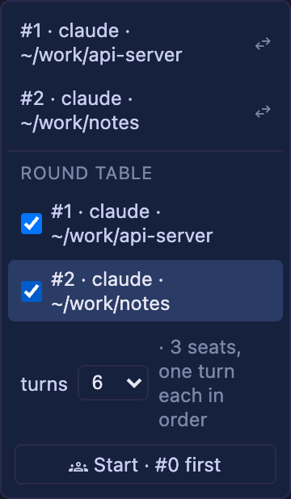

# 4.6.0 — セル同士が会話する

**2026-08-06 に書いたスナップショットです（MulmoTerminal 4.6.0）。** ここに書いた挙動はその日に
出荷されたものです。古くなっていくのは想定どおりなので、最新の内容は各節からリンクしている
ガイド本体を見てください。

```bash
npx mulmoterminal@latest
```

**設定するものはありません。** 4.6.0 を動かせばすべて有効です。使う前に読んでおく価値があるのは、
Round table の「コスト」の項だけです。

---

## Round table — セル同士の会話を始める

セル間の受け渡し（Cross-terminal talk）は 2.x からありました。ボタンを押すと、あるセルの直前の
ターンが別のセルへ運ばれる — 1往復、1回きり。**Round table はそれをループにしたもの**です。
最大5席のリングを、指定したターン数だけ自動で回します。

### 始め方

1. エージェントの入った**セルを2つ以上**開きます。Claude / Codex / Antigravity / Grok は
   どう混ぜても構いません。エージェント同士が互いを知っている必要はありません。
2. **最初に喋らせたいセル**で、ツールバーの **forum** ボタン（セル2行目の吹き出しアイコン。
   他の端末の直前ターンを引っぱってくるときに使う、あのメニュー）を開きます。
3. **ROUND TABLE** の下で、席に着かせたいセルにチェックを入れます。
4. **turns** を選び、**Start** を押します。



ドロップダウン横の注記は**自分を含めて**数えます。2席チェック + 開始したセルで
`3 seats, one turn each in order` です。ボタンには最初に喋るセルの名前が出ます（`Start · #0 first`）。

### 押す前に — これはいくらかかるか

**1ターン = 実アカウント上の実際のエージェント1ターン**です。つまりこの予算は暴走ガードであると
同時に**支出の上限**でもあります。3人で予算 20 なら、エージェントのフルターンが 20 回。走り出した
あとに再確認は入りません。既定は **6**、ほかに 4 / 10 / 20 が選べます。

まずは小さく。3人 × 6ターンあれば、その会話が続く見込みがあるかは分かります。

### 終わる条件

| 終わるとき | |
|---|---|
| **合意したとき** | 返答に `ROUND-TABLE-DONE` の行が単独で含まれたとき。マーカーのことは全席に渡される文面に書いてあるので、エージェント自身が終わらせられます |
| **予算切れ** | 指定したターン数 |
| **相手が時間内に答えない** | 1往復の受け渡しと同じタイムアウト |
| **停止を押したとき** | 実行中は Start ボタンが **running — stop** に変わります |
| **セルを閉じたとき** | 開始したセルを閉じるとリングも止まります |

マーカーは**行全体一致**で判定します。`ROUND-TABLE-DONE` を話題にしただけでは終わりません。

### v1 でできないこと

- **runner はブラウザの中にいます。** タブを閉じるとリングは止まります。サーバ側のジョブでは
  ありません。
- **席は最大5つ**（開始したセルを含む）。
- **エージェントのセルだけ**が対象です。参加する「部屋」も MCP ツールもなく、エージェント側から
  テーブルを始めたり他のセルを見つけたりする手段はありません。人間が席にチェックを入れる —
  その picker が唯一の入場管理です。
- **議事録は残りません。** 会話は通常どおり各エージェント自身のトランスクリプトに残ります。

参照: ガイド本体の [機能一覧](features.html)。

---

## 履歴は「選んだエージェントのもの」になった

**設定は不要です。** これまで起動フォームの **OR RESUME HERE** の行は、Agent Picker で何を選んで
いても Claude のトランスクリプトディレクトリから読まれていました。Codex を選んでも並ぶのは
*Claude* の会話で、それをクリックすると codex のエンドポイントが Claude のトランスクリプトに
つながっていました。逆に、素の端末で始めた codex / Antigravity / Grok の会話は、どの画面からも
到達できませんでした。

いまは picker に追従します:

| Agent Picker | その下に並ぶもの |
|---|---|
| **Claude** | `~/.claude/projects`。見出しは `or resume here` のまま |
| **Codex** | codex の rollout。見出しは `or resume a codex conversation here` |
| **Antigravity** | agy 自身の会話。見出しは `agy` |
| **Grok** | このディレクトリの `~/.grok/sessions`。見出しは `grok` |
| **Shell** | 一覧なし（シェルに再開する会話はありません） |

picker を切り替えると一覧も入れ替わります。行から再開すると、その会話を書いたエージェントの
エンドポイントにつながります。**カスタムエージェント**は Claude Code を動かすので、Claude の
一覧が出ます。

参照: ガイド本体の [基本編](basics.html)。

---

## 誰も attach していないセッションが表示され、そこで止められる

**設定は不要です。** 同じ一覧の行に **● running** が付くようになりました:


**これが意味すること。** その会話のセッションはまだ生きていて（エージェントのプロセスが動いて
いて）、**どの端末もそれを掴んでいない**状態です。サーバを再起動したときに残るのがこれです。
ブラウザ側はセッションを失い、エージェントは終了せず、そしてこれまでどの画面からもその存在が
見えませんでした。だから溜まります。21 セッションが残っていた実機では、**5つ**が 10〜11 時間
放置された生きたエージェントでした。

**できること。**

- **行をクリック**すればこれまでどおり再開します。すでに動いていたセッションがそのまま戻ります。
- **横の停止ボタン**で終了できます。確認が入ります:

  > Stop the session running "Add a health check endpoint"? Its conversation is kept — you can
  > resume it later — but anything it is doing right now is lost.

  **会話は残ります。** トランスクリプトはディスク上に残り、あとから再開できます。失われるのは
  実行中だったターンです。

**ボタンが出るのは attach されていない行だけ**です。`● open` の行はいまどこかの端末が掴んでいる
もの（ここからは見えないタブかもしれません）なので、停止は提示されません。

**これは手動側の半分です。** 一覧はディレクトリ単位・エージェント単位なので、もう開かなくなった
プロジェクトには届きません。自動クリーンアップは
[#1467](https://github.com/receptron/mulmoterminal/issues/1467) として残っています。

参照: ガイド本体の [基本編](basics.html)。

---

## どのエージェントのセルもモデル名とコンテキストを出す

**設定は不要です。** セルヘッダ1行目の2つのバッジ — モデル名とコンテキスト使用率、そして
`⇡ ⇣` の消費トークン — は Claude のセルにしか出ていませんでした。いまはそのセルが動かしている
エージェントについて答えます。どれも**自分のログに実際に書いてあること**だけを出します:

| セル | モデル + コンテキスト | トークン |
|---|---|---|
| **Claude** | `Opus · ctx 35%` | `⇡427k ⇣1.8k` |
| **Codex** | `gpt-5.5 · ctx 33%` — 窓は codex 自身のログから（このアプリ側の表ではない） | あり |
| **Grok** | `Grok · ctx 33%` — grok の実際の窓（grok-4.5 で 500,000） | あり |
| **Antigravity** | `Gemini 3.6 Flash · ctx 78%` — agy が**その会話について**記録したモデル | あり |

知っておくとよいことが2つあります:

- **読めなかったことは 0 ではありません。** トークンが読めなければ `ctx 0%` ではなくモデル名
  だけを出します。モデル名も読めなければバッジ自体を隠します。推測はしません — この数字は
  compact するかどうかを判断するために見るものなので、間違った % は「% が無い」より悪いからです。
- **Grok と Antigravity は1分ごとに更新されます。** ターン終了を通知してくれないので、セルが
  ポーリングします。これが無いと、セルが最初に読んだ値のまま固まってしまいます。Claude と Codex
  は従来どおりターン終了時に更新されます。

参照: ガイド本体の [基本編](basics.html)。

---

## 入ったかどうかの確認

```bash
npx mulmoterminal@latest --version
```

`4.6.0` と出れば入っています。2つ目のセルを立てた状態でセルの **forum** メニューを開き、端末一覧の
下に **ROUND TABLE** のセクションが無ければ古いビルドです。`npx` はキャッシュするので、
取り直すには `@latest` を付けてください。
