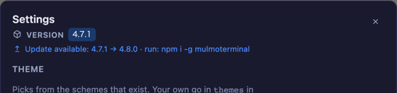
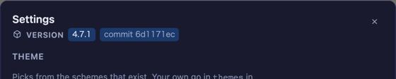

# 4.7.1 — 動いているバージョンが画面に出る

**2026-08-07 に書いたスナップショットです（MulmoTerminal 4.7.1）。** ここに書いた挙動はその日に
出荷されたものです。古くなっていくのは想定どおりなので、最新の内容は各節からリンクしている
ガイド本体を見てください。

```bash
npx mulmoterminal@latest
```

**このリリースに設定は不要です。** 以下はすべて 4.7.1 を動かした時点で効いています。

---

## 設定画面が「いま動いているビルド」を教えてくれる

ツールバーの歯車から **Settings** を開くと、タイトルの下に **Version** の行があります。



これが機能のすべてです。バグ報告に貼る番号を、アプリを離れずに読めます。これまでは「自分は何を
動かしているのか」を知るには別のターミナルで `npx mulmoterminal@latest --version` を叩くしかなく、
ヘッダーの **Update** バッジは新しいものがあるときだけ出て、**いま入っているバージョンは名乗らない**
ものでした。

### 何が出るかは、入れ方で変わります

**npm で入れた場合**（`npx mulmoterminal` / `npm i -g mulmoterminal`）— 同梱の `package.json` の
バージョン。レジストリに新しいものがあれば、ヘッダーバッジと同じ更新通知が実行コマンド込みで
続きます。モーダルを開いている間バッジは後ろに隠れるので、この行で繰り返しています。

**git チェックアウトで動かしている場合** — バージョンに加えてコミットが出ます。



チェックアウトで意味を持つのはコミットのほうです。`package.json` のバージョンは「最後にリリース
された時点」のものなので、リリースコミットでも、その 50 コミット先でも同じ `4.7.1` のままです。
実際に動いているビルドを特定するのは短い HEAD sha です。

### 更新通知をオフにしている場合

`MULMOTERMINAL_NO_UPDATE_CHECK=1` と `NO_UPDATE_NOTIFIER=1` の挙動は今までどおりです（コンソールの
通知なし・ヘッダーバッジなし・ネットワークアクセスなし）。**Version 行はこれに影響されません。**
このスイッチは「うるさいのを止める」ためのもので、「どのビルドかを隠す」ためのものではないからです。
バージョンとコミットを読む処理はマシンの外に出ません。

### 効いているかの確かめ方

Settings を開いてください。タイトルの下が `VERSION 4.7.1` になっていれば入っています。

---

## Agent Picker のエージェントに固有のマークが付きました


これまでの Agent Picker は同じ太さの単語が 6 つ並んでいるだけで、どのボタンがどのツールを起動するのか
は何も語っていませんでした。組み込みのエージェントは、アプリの他の場所で使っているのと同じ形を
picker でも出します（Anthropic のバースト、Codex の交差した輪、Antigravity の四芒星、Grok の折れた X、
Muse の M）。

エージェント**ではない** 2 つには別のアイコンが付きます。**Shell** はターミナル、
[カスタムエージェント](providers.html)はスライダーです。カスタムエージェントは中身が Claude Code でも
**あえて Claude のバーストにしていません** — Claude の行と見分けがつかない行こそ、この変更が直したかった
ものだからです。

設定は不要で、挙動は変わりません。

---

## 長いシードプロンプトでセッションが死ななくなりました

**スキル**を指定してセルを起動したとき（MulmoTerminal が新しいセッションに書き込むシードプロンプト）に
失敗する経路が 2 つあり、どちらも直しています。既定で有効、設定は不要です。

**長すぎる場合（全プラットフォーム）。** 永続セッションは
`tmux new-session -A … -- <bin> <args>` で起動しますが、tmux はコマンドラインが長すぎると受け付けません。
その上限を超えると `command too long` が返り、**引数ではなくセッションごと死んで**いました。tmux 3.7b で
実測したところ、16,375 バイトの引数 1 つで失敗し、10,000 バイトの引数 2 つでも失敗します。予算は引数ごと
ではなくコマンドライン全体にかかります。

**4,096 バイト**を超えるシードは、ファイルに書いてコマンドラインには「それを読め」という 1 行だけを
渡すようになりました。文字数ではなくバイト長です。tmux が数えるのはバイトで、日本語は 1 文字 3 バイトなので、
2,000 文字の日本語（6,000 バイト）はファイル経由、同じ 2,000 文字の ASCII はそのままになります。

**改行を含む場合（Windows）。** `grok` / `antigravity` / `muse` はシードをコマンドラインに直接載せますが、
Windows のコマンドラインは改行を表現できません。そのため `.cmd` インストールでは、引数付きスキルで
起動するたびに `UnsafeArgumentError` で失敗していました。Windows では多行シードもファイル経由になります。

この 2 つのケース以外は何も変わりません（プロンプトは今までどおりそのまま渡ります）。ファイル経由に
なった場合、エージェントの最初の行動はそのファイルを読むことになります。

報告は [@chikara813](https://github.com/receptron/mulmoterminal/issues/1518) さん。

---

## そのほか

- **duplicate-code アラート 2 件を解消**（#1523）— コレクションのレコード action の前に置くガードが、
  親ルートと view token ルートで写しになっていました。認可チェックが片方だけずれる、という壊れ方をする
  ところです。共有モジュール 1 つにまとめました。挙動は変えていません（ステータス・文言・ルートごとの
  チェック順はそのまま）。

---

## リンク

- [設定方法](config.html#settings-modal) — 設定モーダルの各セクション
- [どの coding agent を使うか](agents.html) — 5 つすべて、最新の内容
- [基本 — 画面の読み方](basics.html) — 起動フォームと picker
- [Changelog](https://github.com/receptron/mulmoterminal/blob/main/docs/ChangeLog.md) — 全リリースと
  対応する pull request
