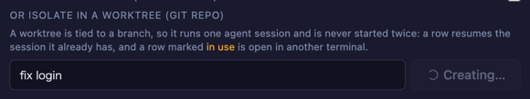
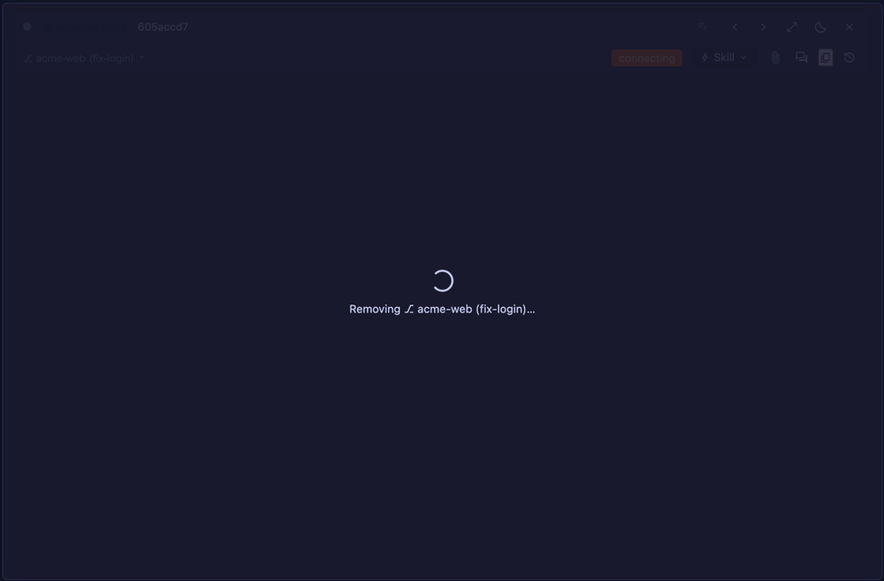
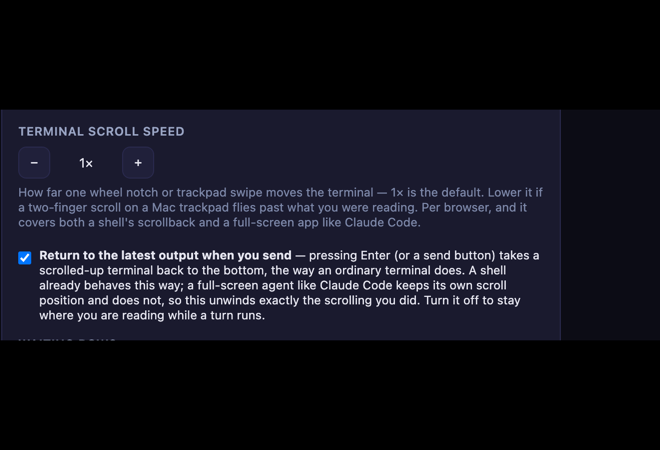

# 4.7.3 — 「いま動いています」と言うボタン

**2026-08-08 にリリースした 4.7.3 のスナップショットです。** アプリが進むにつれて内容は古くなり
ますが、それは想定どおりです。常に最新の情報は、各セクションから貼っている本編ガイドのリンクを
たどってください。

```bash
npx mulmoterminal@latest
```

**このリリースで決めることは 1 つ、チェックボックス 1 個だけです。** 「Enter を押したときに、
スクロールした画面を最新の出力へ戻すかどうか」。既定は **on** です →
[送信時に最新の出力へ戻す](#送信時に最新の出力へ戻す)。それ以外は 4.7.3 を起動した時点で有効で、
設定は要りません。

---

## このリリースの中心にある不具合

**`+ New worktree` が押しても何も変わらないので、もう一度押す。すると worktree がもう 1 本できる。**

`git worktree add` は作業ツリーを丸ごとチェックアウトします。報告者のモノレポ（約 33,000
ファイル）では約 6 秒。その 6 秒のあいだ、起動フォームは**押す直前とまったく同じ見た目**でした。
スピナーも無し、ボタンも無効にならない。だから押し増され、そしてその全部が成功していました
— `agent/fix-login`、`agent/fix-login-2`、`agent/fix-login-3`。中身の同じ作業ツリーが 3 本です。

同じ 1 行が、失敗も隠していました。サーバが作成を拒否しても画面には**何も出ません**。報告者の
実際の原因は「ローカルに base ブランチが無い」ことでしたが、そこにたどり着くには配布された
JavaScript バンドルを読む必要がありました。

### 今どう見えるか

1 回押すとボタンは自分をロックし、スピナーを回し、何をしているか表示します。もう一度押しても、
押せるものがもうありません。



同じルールが、そのセクションの**すべての**コントロールに掛かります。どれも 1 つのリポジトリで
git を実行するからです — worktree の行も、その隣の削除ボタンも。押したものがスピナーを回し、
残りは終わるまで押せなくなります。

サーバが拒否したときは、サーバ自身の言葉でそう出ます:

> fatal: Not a valid object name: 'main'.

メッセージは worktree セクションの下に出て、タスク名は再試行できるように残り、ボタンも戻ります。
**設定は不要**です。4.7.3 の起動フォームはこう振る舞います。

> **`Not a valid object name` が出たときは:** worktree の分岐元ブランチがローカルに無い、という
> 意味です。リポジトリで `git branch main origin/main` を実行すれば直ります。`main` を checkout
> していた worktree を「ブランチも削除」付きで消すと、この状態になります →
> [worktree（本編）](worktree.html)

---

## worktree を閉じるときも、閉じているように見える

worktree の削除は `git worktree remove` を実行します。大きなリポジトリでは作成と同じだけ時間が
かかるのに、これまではセルがまったく生きているように見えたままでした。

いまは、ヘッダも含めてセル全体がグレイアウトし、何を消しているかを書いたスピナーが 1 つ出ます:



処理中はそのセルの中身をクリックもキーボード操作もできません。確認ダイアログを途中で閉じることも
できません — その時点でターミナルはすでに終了しており、ブランチも削除されているところだからです。
削除が**失敗**した場合は、理由付きで確認ダイアログが戻ってきて、再試行かセルを閉じるかを選べます。

設定は不要です。worktree そのものについては [worktree](worktree.html) を参照してください。

---

## 送信時に最新の出力へ戻す

4.7.3 で「変えるかどうか決める」のはこれだけです。

Claude Code のセルで何かを読むためにスクロールし、そのまま Enter を押す。これまでは、その位置に
留まったままでした。普通のターミナルはそうなりませんし、MulmoTerminal の**シェル**のセルでも
戻ります。この差には理由があります — Claude Code のような全画面アプリはスクロール位置を自分で
持っているので、こちら側に戻す対象が無かったのです。

4.7.3 がやるのは、**自分がやったスクロールをちょうど巻き戻す**ことです。そのホイールイベントを
合成しているのは MulmoTerminal 自身なので、送ったノッチ数を数えておき、送信時に同じ数だけ下向きに
返します。スクロールしていなければ 1 バイトも送りません。

**既定は on です。** off にするには **Settings**（ツールバーの歯車）→ **Terminal scroll speed**
→ その下のチェックボックス。



この設定は上のスクロール速度と同じく**ブラウザごと**です。そのブラウザの localStorage に入るので、
ノート PC とスマホで別々にでき、別のマシンには引き継がれません。

**off にするとよいのは**、ターンが動いているあいだ遡って読みたくて、次のメッセージを送るたびに
画面が最下部へ飛ぶのは困る、という場合です。

**効いていることの確かめ方:** 履歴が数画面ぶんある Claude Code のセルを開き、2〜3 ノッチ
スクロールしてから何か入力して Enter。最新の出力の位置に戻れば効いています。スクロールしていない
ときの挙動はこれまでどおりです。

ターミナルの他の挙動との関係は [機能](features.html) を参照してください。

---

## 4.7.3 になっているかの確認

```bash
npx mulmoterminal@latest --version
```

起動中のインスタンスなら、worktree セクションにタスク名を入れて `+ New worktree` を押してみて
ください。ボタンが減光して **Creating…** になれば 4.7.3 です。

---

## このリリースの中身

| | |
|---|---|
| [#1549](https://github.com/receptron/mulmoterminal/issues/1549) | `+ New worktree` がクリックの回数だけ worktree を作っていた。worktree のコントロールはすべて処理中は自分をロックし、進行を表示し、拒否されたときはサーバの理由を出す。 |
| [#1551](https://github.com/receptron/mulmoterminal/issues/1551) | worktree を削除中のセルは全体がグレイアウトしてスピナーが回り、クリックも Tab 移動もできなくなる。 |
| [#1546](https://github.com/receptron/mulmoterminal/issues/1546) | Enter でスクロールした画面が最新の出力へ戻る。既定 on、Settings のチェックボックスで切り替え。 |

---

過去のリリース: [4.7.2](v4.7.2.html) · [4.7.1](v4.7.1.html) · [4.7.0](v4.7.0.html)

## 続きを読む

- [基本編 — 画面の読み方](basics.html) — 起動フォーム、チップ、ロスター
- [worktree](worktree.html) — タスクごとに独立したブランチ
- [機能](features.html) — コレクション、Wiki、会計、ファイルエクスプローラ
- [設定](config.html) — すべての設定（常に最新）
- [変更履歴](https://github.com/receptron/mulmoterminal/blob/main/docs/ChangeLog.md) — 各リリースと
  その pull request
