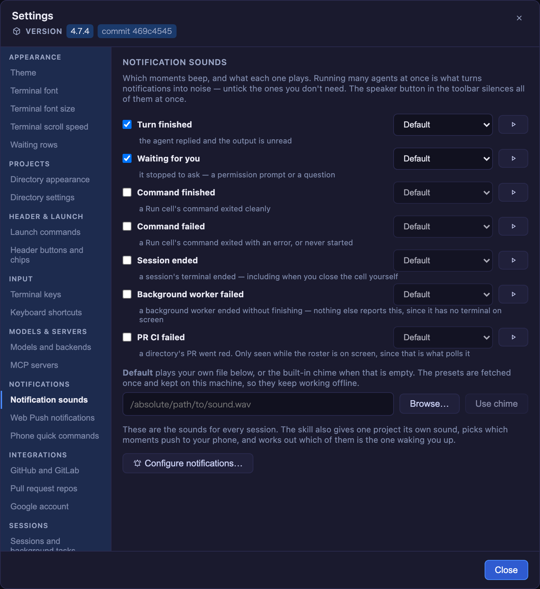
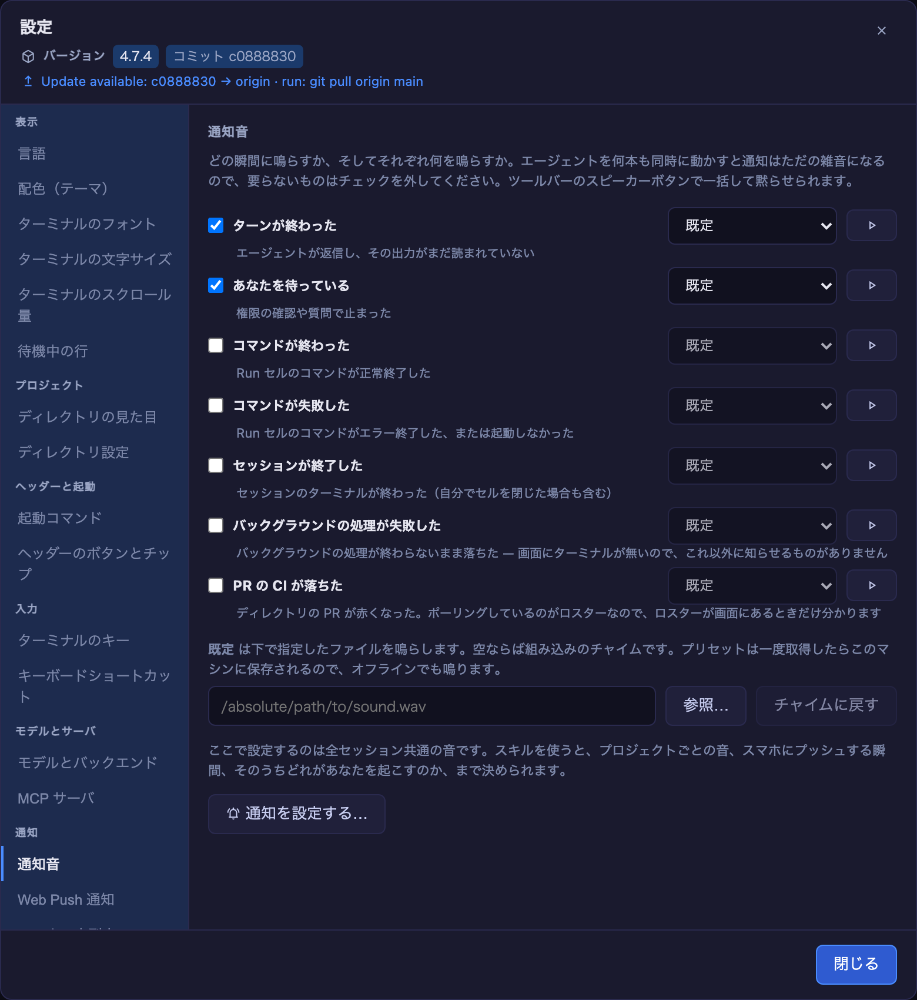
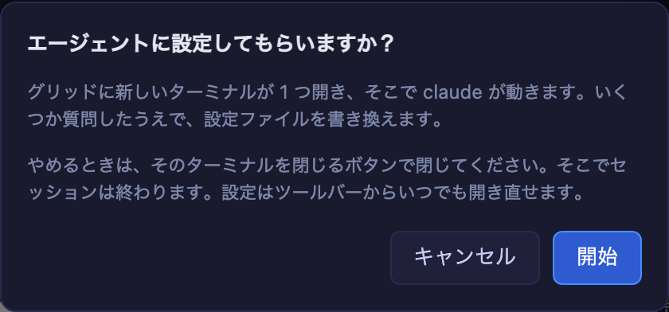

# 4.7.5 — 設定を、探せる形と読める言葉で

**2026-08-09 にリリースされた 4.7.5 のスナップショットです。** アプリが進むにつれて内容は古くなり
ますが、それは想定どおりです。常に最新の情報は、各セクションからリンクしている本編ガイドを見て
ください。

```bash
npx mulmoterminal@latest
```

**新しいレイアウトのために設定することは何もありません** — 設定を開けばそうなっています。1 分だけ
見る価値があるのは新しい **Language（言語）** の設定ですが、ブラウザが日本語を要求していれば、それ
もすでに選ばれています。

---

## 設定がサイドバーになりました

ツールバーの歯車から設定を開きます。長い 1 本のスクロールではなく、左に **9 つのグループのサイド
バー**、右に **一度に 1 セクション** が出ます。



どこに何があるか:

| グループ | セクション |
| --- | --- |
| **表示** | 言語、配色（テーマ）、ターミナルのフォント、ターミナルの文字サイズ、ターミナルのスクロール量、待機中の行 |
| **プロジェクト** | ディレクトリの見た目、ディレクトリ設定 |
| **ヘッダーと起動** | 起動コマンド、ヘッダーのボタンとチップ |
| **入力** | ターミナルのキー、キーボードショートカット、音声入力 |
| **モデルとサーバ** | モデルとバックエンド、MCP サーバ |
| **通知** | 通知音、Web Push 通知、スマホの定型文 |
| **連携** | GitHub と GitLab、プルリクエストのリポジトリ、Google アカウント |
| **セッション** | セッションとバックグラウンド処理、再起動を生き延びたセッション、コスト（推定） |
| **ヘルプ** | ヘルプとユーザーガイド |

**音声入力**は文字起こしできるマシンでのみ出るので、25 項目のうち多くの環境で見えるのは 24 です。

知っておくとよいことが 3 つ:

- **キーボードでは、サイドバー全体が Tab 1 回分です。** Tab で入ったら、あとは**矢印キー**でセク
  ションを移動します（端で折り返します）。24 個の Tab ストップを並べたら、置き換えたスクロールより
  打鍵数が増えてしまうためです。
- **スマホでは**、サイドバーは幅を食わずに**セクションの上のセレクタ**になります。
- **入力したけれど適用していない値は、別のセクションを見に行って戻ってきても残ります。** これが効
  くのはターミナルのフォント欄です。スタックを打ち込み、別を見て、戻ってきても消えていません。

→ 本編: [設定モーダル（Settings）— どこで何を変えられるか](config.html#settings-modal)

---

## 設定画面の日本語表示

設定モーダル全体が **英語と日本語**で表示できるようになりました。



**たいていの場合、何もしなくて構いません。** 既定は「ブラウザの言語にあわせる」なので、日本語を要求
するブラウザなら、最初に設定を開いた時点で日本語になっています。

明示的に選ぶには:

1. **設定**（ツールバーの歯車）を開きます。
2. **サイドバーのいちばん上** — *表示* の中の **言語** です。先頭に置いてあるのは意図的で、画面の
   他が読めない人が最初に必要になるのがこの設定だからです。
3. **ブラウザの言語にあわせる** / **English** / **日本語** から選びます。即座に反映されます（リロー
   ドもサーバ再起動も不要）。

**効いたかどうかの見分け方**: サイドバー自身が一緒に変わります。`Notification sounds` が `通知音` に、
グループ見出しが `表示` / `通知` / `入力` になります。

**保存先**: そのブラウザの `localStorage` です。配色やターミナルの文字サイズと同じで、
`~/.mulmoterminal/config.json` **ではありません**。同じサーバを見ているスマホと PC がそれぞれ別の
言語を持てますし、ここでの選択が同じサーバを使う他の人に伝わることもありません。

**4.7.5 で訳されているのは設定モーダルだけです。** ツールバー・セル・オーバーレイは英語のままで、
その旨は言語のペインにも書いてあります。他の画面は以降のリリースで順次進めます。

→ 本編: [設定モーダル（Settings）— どこで何を変えられるか](config.html#settings-modal)

---

## skill ボタンが、始める前に確認するようになりました

設定のいくつかのセクションはエージェントに引き渡します — **Create a theme…**、
**Configure notifications…**、**Set up shortcuts…** など。押すと、グリッドの新しいセルで本物の
エージェントセッションが始まります。

これまでは押した瞬間にそれが起き、しかも設定はすでに閉じたあとでした。4.7.5 では**先に確認します**:



- **各ボタンの下の 1 行**が、押す前から「設定はエージェントが書く」と伝えます。
- ダイアログは**ランチャで選んでいるエージェント名**（`claude`、`codex`、最後に選んだもの）を出しま
  す。実際に起動するのがそれだからです。
- **キャンセル**を押すと、元いた場所にそのまま戻ります（設定は同じセクションを開いたまま）。
  **Escape** も同じで、*2 回目*の Escape で設定が閉じます。
- どちらの方法で断っても、**フォーカスは押したボタンに戻ります**。キーボード操作の人が居場所を失い
  ません。
- **開始**を押したあとで気が変わったら、そのターミナルを閉じるボタンで閉じてください。そこでセッシ
  ョンは終わります。設定はツールバーからいつでも開き直せます。

→ 本編: [設定モーダル（Settings）— どこで何を変えられるか](config.html#settings-modal)

---

## アップグレード

```bash
npx mulmoterminal@latest
```

`~/.mulmoterminal/config.json` は変わりません。既存の設定が移動したり名前が変わったりすることもなく、
変わるのは画面上のどこに出るかだけです。アップグレード中にブラウザのタブを開いていたなら、リロード
してください。
